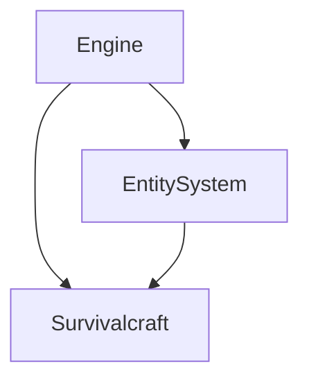
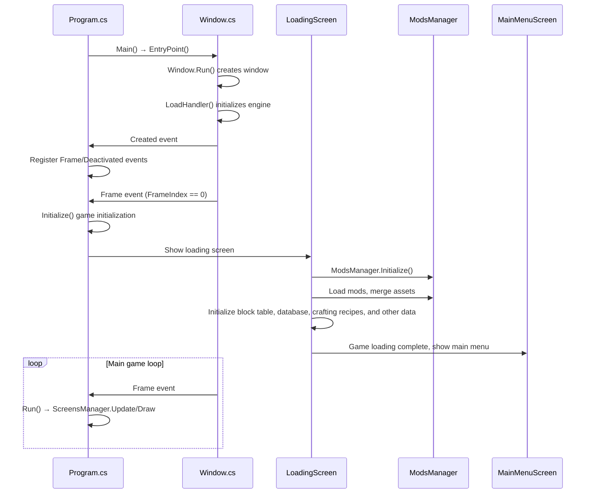
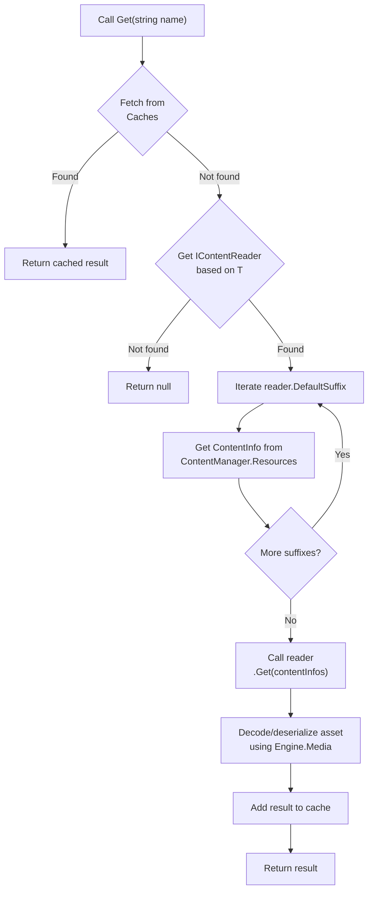
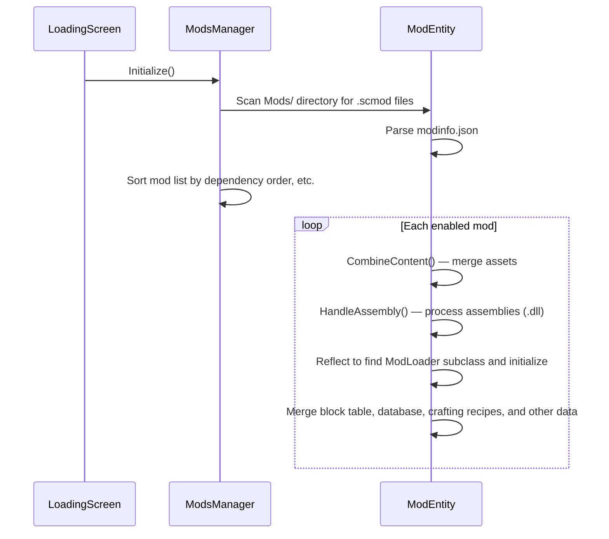

!!! info inline end "Attribution"

    This text is derived and translated to English from `docs/Architecture.md` from the Survivalcraft API Gitee Repository.

This document is aimed at API client developers and mod developers, helping them quickly understand the overall architecture and runtime behavior of the project.

## 1. Project Technical Overview

| Item | Description |
|------|-------------|
| **Programming Language** | C# |
| **Target Framework** | .NET 10 |
| **Graphics API** | OpenGL ES 3.2 (wrapped via Silk.NET) |
| **Windowing Library** | GLFW for desktop, SDL for mobile |
| **Target Platforms** | Windows, Linux, Android, iOS, Browser (WebAssembly) |
| **Game Type** | 3D voxel sandbox, wilderness survival, supports up to 4 players on the same screen |
| **Mod Support** | Asset overrides, ModLoader hooks, HarmonyX method injection, JavaScript execution |

## 2. Overall Layered Architecture

The project uses a three-layer architecture with dependencies flowing bottom-up:



### Layer Responsibilities

| Layer | Responsibilities | Key Contents |
|-------|-----------------|--------------|
| **Engine** | Low-level engine services | Window management, graphics rendering, audio playback, input handling, media decoding, serialization |
| **EntitySystem** | Entity system framework | Entity, Component, Subsystem, template database |
| **Survivalcraft** | Game business logic | Block definitions, concrete manager/subsystem/entity component implementations, UI, mod support |

## 3. Directory Structure at a Glance

```
/workspace/
├── Engine/                      # Core engine code (shared across platforms)
│   ├── Engine/                  # Core modules: Window, Display, Log, etc.
│   ├── Engine.Audio/            # Audio playback
│   ├── Engine.Graphics/         # Graphics rendering, shaders, textures, etc.
│   ├── Engine.Input/            # Keyboard, mouse, gamepad, touchscreen input
│   ├── Engine.Media/            # Decoding images, audio, models, and other assets
│   └── Engine.Serialization/    # Data serialization
│
├── Engine.<Platform>/           # Platform-specific engine code (minimal)
│
├── EntitySystem/                # Entity system framework
│   ├── GameEntitySystem/        # Entity, Component, Subsystem, Project
│   └── TemplatesDatabase/       # Database templates, ValuesDictionary
│
├── EntitySystem.<Platform>/     # No platform-specific code
│
├── Survivalcraft/               # Game core (shared across platforms)
│   ├── Content/Assets/          # Game assets (textures, audio, models, XML data)
│   │   ├── Atlases/             # Sprite atlases
│   │   ├── Audio/               # Audio assets
│   │   ├── Dialogs/             # Dialog layouts
│   │   ├── Fonts/               # Fonts
│   │   ├── Langs/               # Localization strings
│   │   ├── Models/              # Model assets
│   │   ├── Music/               # Music assets
│   │   ├── Screens/             # Full-screen UI layouts
│   │   ├── Shaders/             # Shaders
│   │   ├── Styles/              # UI styles
│   │   ├── Textures/            # Texture assets
│   │   ├── Widgets/             # UI widget layouts
│   │   │
│   │   ├── BlocksData.txt       # Block table
│   │   ├── Clothes.xml          # Clothing data
│   │   ├── Clothes.xsd          # Clothing data schema definition
│   │   ├── CraftingRecipes.xml  # Crafting recipes
│   │   ├── CraftingRecipes.xsd  # Crafting recipes schema definition
│   │   ├── Database.xml         # Database
│   │   ├── Database.xsd         # Database schema definition
│   │   ├── NewWorldNames.txt    # New world name list
│   │   └── RecoveryProject.xml  # Used to attempt recovery of corrupted saves
│   │
│   ├── Block/                   # All block definitions
│   ├── Component/               # Entity component implementations
│   ├── ContentProvider/         # Content providers
│   ├── Dialog/                  # Dialogs
│   ├── ElectricElement/         # Circuit elements
│   ├── Game/Program.cs          # Program entry point
│   ├── IContentReader/          # Asset readers
│   ├── Managers/                # Vanilla game managers
│   ├── ModsManager/             # Mod support implementation
│   ├── Screen/                  # Full-screen UIs
│   ├── Subsystem/               # Subsystem implementations
│   └── Widget/                  # UI widgets
│
├── Survivalcraft.<Platform>/    # Platform-specific game startup code
│
├── build/                       # .props build property files
└── SurvivalcraftApi.sln         # Solution file
```

> **Tip**: Open `SurvivalcraftApi.sln` in your IDE and you'll see a dedicated directory for each platform. Right-clicking a directory lets you conveniently unload all projects for platforms you don't need.

## 4. Game Startup Flow



### Key Step Descriptions

1. **Program Entry** [Program.cs](https://gitee.com/SC-SPM/SurvivalcraftApi/blob/SCAPI1.9/Survivalcraft/Game/Program.cs)
   - `Main()` handles command-line arguments (Windows only)
   - Calls `EntryPoint()` to begin game initialization

2. **Window Creation** [Window.cs](https://gitee.com/SC-SPM/SurvivalcraftApi/blob/SCAPI1.9/Engine/Engine/Window.cs)
   - Creates a cross-platform window using Silk.NET and initializes the OpenGL ES context
   - Fires the window `Load` event, calling `LoadHandler()` to initialize the engine and register window events
   - Fires the window `Render` event; game initialization begins on the first frame

3. **Game Initialization** `Program.Initialize()`
   - Initializes `SettingsManager`, `ScreensManager`, and other managers
   - Enters `LoadingScreen`

4. **Content Loading** [LoadingScreen](https://gitee.com/SC-SPM/SurvivalcraftApi/blob/SCAPI1.9/Survivalcraft/Screen/LoadingScreen.cs)
   - Loads and sorts the mod list
   - Merges assets, then begins rendering the game screen
   - Merges the block table, database, crafting recipes, and other data
   - Initializes `BlocksManager`, `DatabaseManager`, and other managers

5. **Main Loop** `Program.Run()`
   - Calls `ScreensManager.Update()` and `ScreensManager.Draw()` every frame

## 5. Core Runtime Mechanism: ECS

The game uses an ECS (Entity-Component-Subsystem) architecture, though it differs from a typical ECS:

### Core Concepts

| Concept | Description | How to Obtain an Instance | Example |
|---------|-------------|--------------------------|---------|
| **Project** | The runtime instance of the game world | `GameManager.Project` | / |
| **Entity** | A game entity; a container for Components | `Project.Entities` | Player, animal, chest |
| **Component** | A behavioral and data component attached to an entity | `Entity.FindComponent<T>()` | ComponentHealth, ComponentBody |
| **Subsystem** | A global subsystem managing a category of functionality; only one instance per subsystem | `Project.FindSubsystem<T>()` | SubsystemTerrain, SubsystemTime |

### Data-Driven Design

Entity and subsystem definitions are stored in `Database.xml`. Mods should also register new entity templates, components, and subsystems into the database.

**Loading Flow**:
1. `Project` is instantiated based on the save's `Project.xml` and `DatabaseManager.GameDatabase`
2. Reflection creates the corresponding `Subsystem` list and `Entity` list
3. Each `Entity` creates its `Component` list from its template
4. Any `Subsystem` or `Component` implementing `IUpdatable` is added to `SubsystemUpdate.m_updateables` and has its `Update` method called every frame; the same applies to those implementing `IDrawable`

## 6. Cross-Platform Strategy

### Shared Code + Platform Projects

```
Engine/              # 99% shared code
Engine.Android/      # Android-specific
Engine.Browser/      # Browser-specific
……
```

### Conditional Compilation

Platform differences are handled using `#if` preprocessor directives, like this:

```cs
#if ANDROID
using Android.Views;
#elif BROWSER
using Engine.Browser;
#elif WINDOWS
using NativeFileDialogCore;
#endif

#if WINDOWS
    // Code that runs only on Windows
#endif
```

**Common Compilation Symbols**:

| Symbol | Platform |
|--------|----------|
| `ANDROID` | Android |
| `BROWSER` | Browser across all platforms (Chrome only); mods not supported |
| `WINDOWS` | Windows desktop |
| `LINUX` | Linux desktop |
| `IOS` | iOS/iPadOS; mod assemblies (`.dll`) not supported |
| `MOBILE` | Equivalent to `ANDROID \|\| IOS` |

Additionally, `Engine.Windows` has a dedicated build using [Angle](https://github.com/google/angle), which allows the game to run on GPU drivers that don't natively support OpenGL ES. It can be built using `BuildEngineWindowsWithUseAngle.bat` in the root directory.

## 7. Asset Pipeline

During loading, the game merges `Content.zip/Assets/` and all mod `*.scmod/Assets/` directories into `ContentManager.Resources`. Files with identical paths are overwritten in load order.  
At runtime, assets are retrieved as a specified type via `ContentManager.Get<T>(string name)`. The general flow is as follows:



> Suffixes listed earlier in `DefaultSuffix` have higher read priority.  
> This method also has an overload that accepts an explicit suffix; when specified, the reader's `DefaultSuffix` is ignored.  
> Most readers only read the first file in the list; some require two files simultaneously.

## 8. Mod System

### Mod Loading Flow



### Mod Data Merging

Mods can modify vanilla data using special attributes:

| Data Type | Game File | Mod File | Merge Behavior |
|-----------|-----------|----------|----------------|
| Block table | `BlocksData.txt` | `*.csv` | Appends new blocks; modifies attributes when class name matches |
| Clothing table | `Clothes.xml` | `*.clo` | Matched by Index; supports `New-` prefix to modify multiple attributes, `Remove` to delete elements |
| Crafting recipes | `CraftingRecipes.xml` | `*.cr` | Appends new recipes; supports `New-` prefix to modify a single attribute, `Remove` to delete (requires all other attributes to match) |
| Database | `Database.xml` | `*.xdb` | Appends new data; matched by Guid; supports `New-` prefix to modify a single attribute, `Remove` to delete elements |
| Localization strings | `Lang/*.json` | Same path | Appends new strings; overwrites strings at the same path |

### ModLoader Hook System

Mods hook into game logic by subclassing [ModLoader](https://gitee.com/SC-SPM/SurvivalcraftApi/blob/SCAPI1.9/Survivalcraft/ModsManager/ModLoader.cs) and overriding its methods:

```cs
public class TemplateModLoader : ModLoader {
    public override void __ModInitialize() {
        ModsManager.RegisterHook("OnLoadingFinished", this, 1);
    }

    // Must be registered in __ModInitialize(); otherwise it has no effect
    public override void OnLoadingFinished(List<Action> actions) {
        Log.Information("Survivalcraft Template Mod: Game Loaded.");
    }
}
```

**Hook Execution Order**:
- By default, hooks execute in mod load order
- Use `RegisterHook(name, loader, priority)` to manually set a hook's execution priority
- Some methods can return `true` to stop subsequent mods from executing

### HarmonyX Method Injection

See the HarmonyX [official documentation](https://github.com/BepInEx/HarmonyX/wiki).

You can call `PatchAll()` inside `ModLoader.__ModInitialize()`:

```cs
public class TemplateModLoader : ModLoader {
    public override void __ModInitialize() {
        Harmony harmony = new Harmony("xfdz.SurvivalcraftTemplateMod");
        harmony.PatchAll();
    }
}
```

### Example Mod Project

[Click here to open](https://gitee.com/SC-SPM/SurvivalcraftTemplateModForAPI)

## 9. Key Managers Quick Reference

> Location: [Survivalcraft/Managers](https://gitee.com/SC-SPM/SurvivalcraftApi/blob/SCAPI1.9/Survivalcraft/Managers/)

| Manager | Responsibilities |
|---------|-----------------|
| `ModsManager` | Mod loading, data merging, hook dispatching |
| `ScreensManager` | Screen transitions, full-screen UI management |
| `DialogsManager` | Showing/hiding dialogs |
| `BlocksManager` | Block registration and lookup |
| `DatabaseManager` | Entity/subsystem template database |
| `CraftingRecipesManager` | Crafting recipe management |
| `SettingsManager` | Game settings persistence |
| `ContentManager` | Asset loading and retrieval |
| `WorldsManager` | Loading save list; creating, importing, and exporting saves |
| `GameManager` | Opening, running, and saving worlds |

## 10. Specialized Technical Documentation

* [Creature Model System](Creature Model System.md) — Skeleton, mesh, animation, and rendering for creature 3D models
* [Terrain System](Terrain System.md) — Terrain data structures, updates, generation, rendering, serialization, and active modification
* [UI System](UI System.md) — Managers, layout flow, major container components, and usage examples for the game's UI
