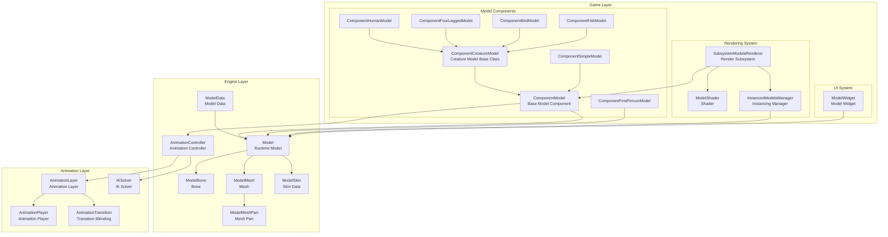
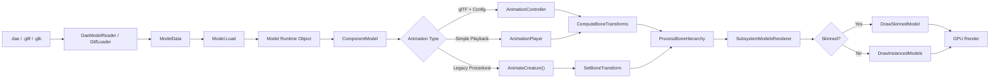
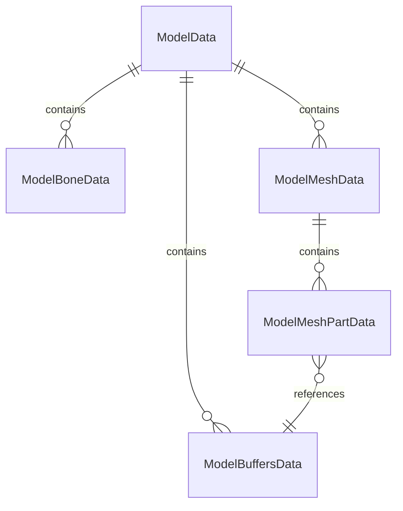
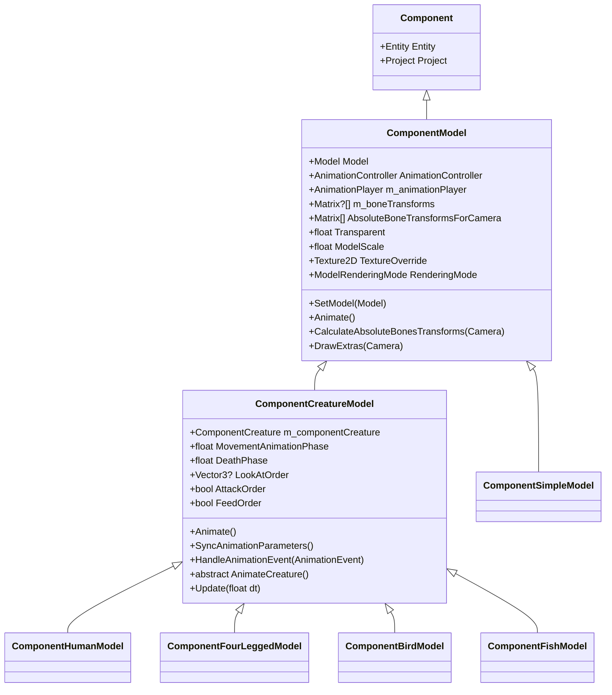
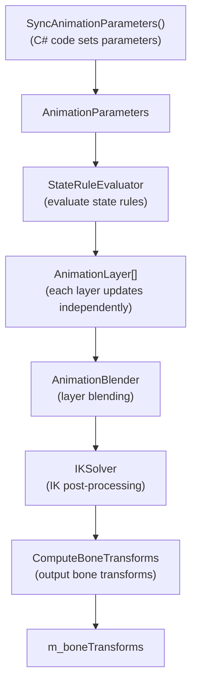
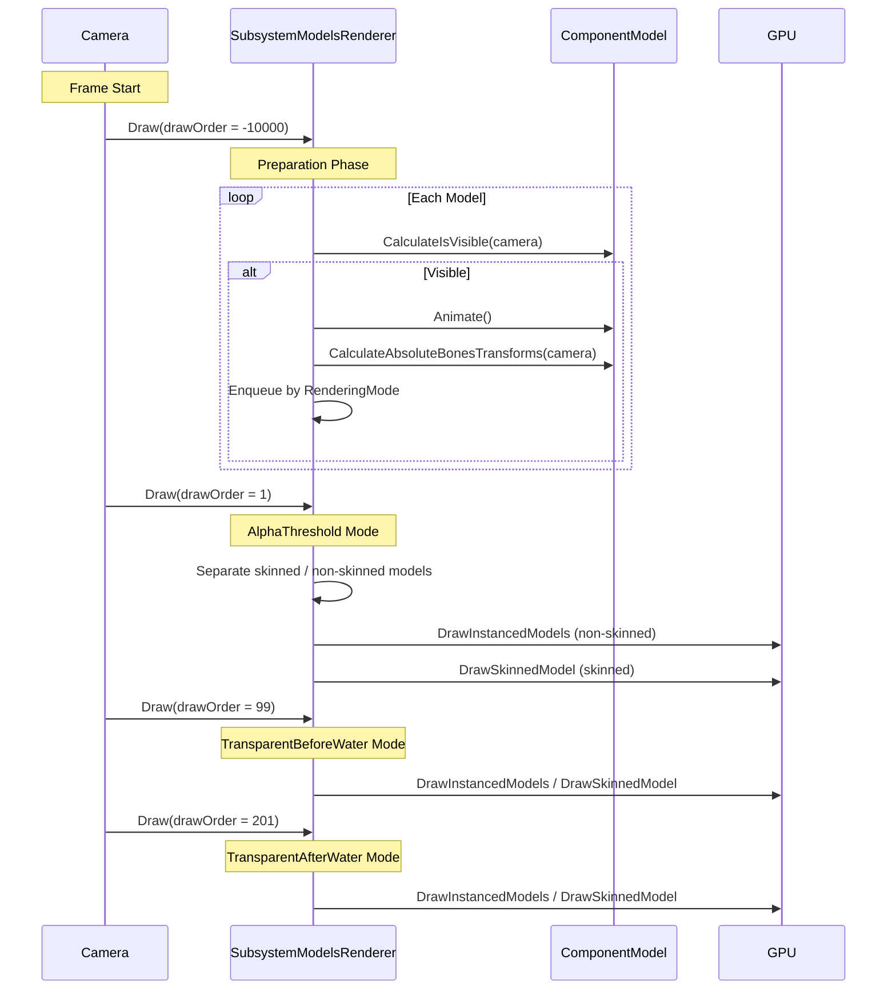
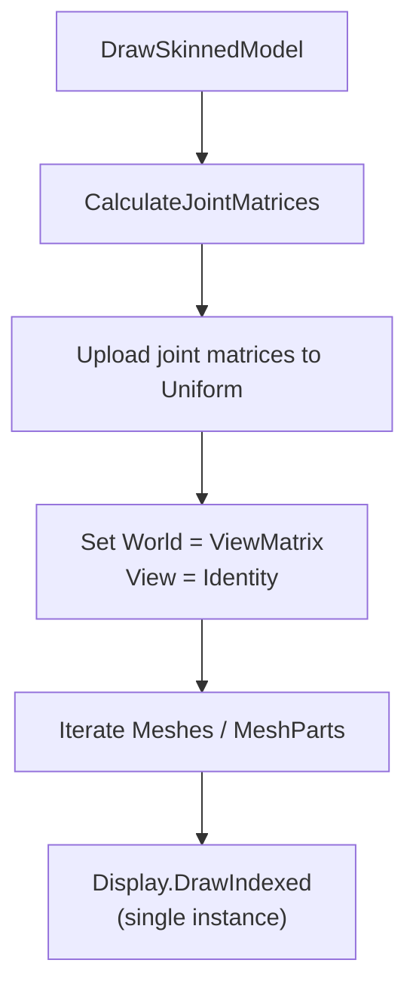
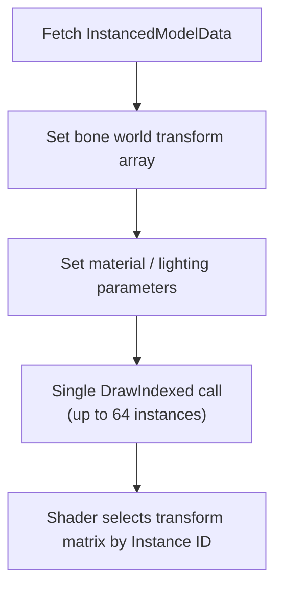

!!! info inline end "Attribution"

    This text is derived and translated to English from [`docs/CreatureModelSystem.md`](https://gitee.com/SC-SPM/SurvivalcraftApi/blob/SCAPI1.9/docs/CreatureModelSystem.md) from the Survivalcraft API Gitee Repository.

This document covers the data structures, component architecture, skeletal animation, and rendering pipeline of the Survivalcraft creature 3D model system.

## Table of Contents

1. [Overall Architecture Overview](#1-overall-architecture-overview)
2. [Core Data Structures](#2-core-data-structures)
3. [Model Component System](#3-model-component-system)
4. [Skeletal Animation Mechanism](#4-skeletal-animation-mechanism)
5. [Rendering Pipeline](#5-rendering-pipeline)
6. [Skinned Rendering](#6-skinned-rendering)
7. [Instanced Rendering Optimization](#7-instanced-rendering-optimization)
8. [Creature Model Implementations](#8-creature-model-implementations)
9. [UI Model Display](#9-ui-model-display)

---

## 1. Overall Architecture Overview

### 1.1 System Architecture Diagram



### 1.2 Core Module Responsibilities

| Module | Layer | Responsibility |
|--------|-------|----------------|
| **Model** | Engine | Runtime model container; manages bone hierarchy, mesh collection, and skin data |
| **ModelBone** | Engine | Bone node; tree structure storing transform matrices |
| **ModelSkin** | Engine | Skin data: joint indices, inverse bind matrices, skeleton root node |
| **AnimationController** | Animation | Animation controller: state rules, layer blending, IK, Root Motion |
| **ComponentModel** | Game | Entity component; manages model rendering state and animation scheduling |
| **ComponentCreatureModel** | Game | Abstract base class for creature models; defines animation parameter sync interface |
| **SubsystemModelsRenderer** | Game | Model rendering subsystem; manages drawing of all models (including skinned rendering) |
| **ModelShader** | Game | Shader parameter wrapper; supports instanced and skinned rendering |

### 1.3 Data Flow



---

## 2. Core Data Structures

### 2.1 ModelData — Model Data Container

`ModelData` is the in-memory representation of a model file, used for serialization and deserialization:

```cs
public class ModelData {
    public List<ModelBoneData> Bones = [];
    public List<ModelMeshData> Meshes = [];
    public List<ModelBuffersData> Buffers = [];
}
```

**Data structure relationships**:



### 2.2 ModelBoneData — Bone Data

```cs
public class ModelBoneData {
    public string Name;
    public int ParentBoneIndex;    // -1 indicates root bone
    public Matrix Transform;
}
```

### 2.3 ModelMeshData — Mesh Data

```cs
public class ModelMeshData {
    public string Name;
    public int ParentBoneIndex;
    public List<ModelMeshPartData> MeshParts;
    public BoundingBox BoundingBox;
}
```

### 2.4 ModelMeshPartData — Mesh Part Data

```cs
public class ModelMeshPartData {
    public int BuffersDataIndex;
    public int StartIndex;
    public int IndicesCount;
    public BoundingBox BoundingBox;
}
```

### 2.5 ModelBuffersData — Buffer Data

```cs
public class ModelBuffersData {
    public VertexDeclaration VertexDeclaration;
    public byte[] Vertices = [];
    public byte[] Indices = [];
}
```

### 2.6 Model — Runtime Model

```cs
public class Model : IDisposable {
    public ModelBone m_rootBone;
    public List<ModelBone> m_bones = [];
    public List<ModelMesh> m_meshes = [];
    public ModelData ModelData { get; set; }

    // Skin data (glTF models)
    public ModelSkin Skin { get; set; }
    public bool HasSkin => Skin != null;

    // Animation data (glTF models)
    public List<ModelAnimation> Animations { get; set; }
    public bool HasAnimations => Animations.Count > 0;

    public ModelBone FindBone(string name, bool throwIfNotFound = true);
    public ModelMesh FindMesh(string name, bool throwIfNotFound = true);
    public ModelBone NewBone(string name, Matrix transform, ModelBone parentBone);
    public void CopyAbsoluteBoneTransformsTo(Matrix[] absoluteTransforms);
}
```

### 2.7 ModelSkin — Skin Data

Skin information from glTF models, containing bone binding data needed for GPU skinning:

```cs
public class ModelSkin {
    public int[] JointIndices;              // Joint bone indices
    public List<ModelBone> Joints;          // Runtime bone references
    public Matrix[] InverseBindMatrices;    // Inverse bind matrices
    public int SkeletonRootIndex;           // Skeleton root bone index
    public ModelBone SkeletonRoot;          // Skeleton root bone reference

    public void ResolveJoints(List<ModelBone> bones); // Resolve indices to bone references
}
```

**Data source**: `GltfBoneConverter.ConvertSkins()` extracts joint indices, inverse bind matrices, and the skeleton root node from the glTF Skin object.

### 2.8 ModelBone — Bone

```cs
public class ModelBone {
    public Model Model { get; set; }
    public int Index { get; set; }
    public string Name { get; set; }
    public Matrix Transform { get; set; }
    public ModelBone ParentBone { get; set; }
    public ReadOnlyList<ModelBone> ChildBones;
}
```

### 2.9 ModelMesh / ModelMeshPart — Mesh

```cs
public class ModelMesh : IDisposable {
    public string Name { get; set; }
    public ModelBone ParentBone { get; set; }
    public BoundingBox BoundingBox;
    public ReadOnlyList<ModelMeshPart> MeshParts;
}

public class ModelMeshPart : IDisposable {
    public VertexBuffer VertexBuffer { get; set; }
    public IndexBuffer IndexBuffer { get; set; }
    public int StartIndex { get; set; }
    public int IndicesCount { get; set; }
    public BoundingBox BoundingBox;
    public string TexturePath;
}
```

---

## 3. Model Component System

### 3.1 Inheritance Hierarchy



### 3.2 ComponentModel — Base Model Component

`ComponentModel` is the base class for all model components, responsible for model loading, animation scheduling, and bone transform calculation.

```cs
public class ComponentModel : Component {
    public Model m_model;
    public AnimationController AnimationController { get; private set; }
    public AnimationPlayer m_animationPlayer;
    public Matrix?[] m_boneTransforms;
    public Matrix[] AbsoluteBoneTransformsForCamera;
    public float m_boundingSphereRadius;
    public float Transparent { get; set; }
    public float ModelScale { get; set; }
    public Vector3 ModelOffset { get; set; }
    public Texture2D TextureOverride { get; set; }
    public ModelRenderingMode RenderingMode { get; set; }
    public bool CastsShadow { get; set; }
    public bool IsVisibleForCamera { get; set; }
    public bool Animated { get; set; }
}
```

### 3.3 Animation Scheduling Priority

#### ComponentCreatureModel.Animate() Override

`ComponentCreatureModel` overrides `Animate()`, syncing parameters before calling `base.Animate()`:

```cs
// ComponentCreatureModel.Animate()
public override void Animate() {
    // 0. Sync animation parameters to AnimationController
    SyncAnimationParameters();

    // 1. Call base Animate() (handles AnimationController / AnimationPlayer / Mod hooks)
    base.Animate();

    // 2. glTF models: apply entity transform (position + rotation) to root bone
    if (Animated && (Model.HasSkin || Model.HasAnimations)) {
        // Compute: root bone transform * entity transform * scale * rotation correction
        m_boneTransforms[Model.RootBone.Index] = rootTransform * entityTransform;
    }

    // 3. Fall back to legacy procedural animation if nothing above handled it
    if (!Animated) {
        AnimateCreature();  // Implemented by subclass (e.g. ComponentFourLeggedModel)
    }
}
```

#### ComponentModel.Animate() Base Class

```cs
public virtual void Animate() {
    // 1. Mod hooks (run first; can set Animated = true to skip remaining steps)
    ModsManager.HookAction("OnAnimateModel", ...);

    // 2. AnimationController (new system, driven by glTF config)
    if (AnimationController != null) {
        AnimationController.Update(Time.FrameDuration);
        AnimationController.ComputeBoneTransforms(m_boneTransforms);
        Animated = true;
        return;
    }

    // 3. AnimationPlayer (simple playback)
    if (m_animationPlayer != null && m_animationPlayer.IsPlaying) {
        m_animationPlayer.Update(Time.FrameDuration);
        m_animationPlayer.SampleBoneTransforms(m_boneTransforms);
        Animated = true;
        return;
    }
}
```

### 3.4 Model Loading and Controller Creation

`ComponentModel.SetModel()` creates an animation controller by priority:

```cs
public virtual void SetModel(Model model) {
    m_model = model;
    if (m_model != null) {
        // 1. AnimationConfigPath (JSON config file) → create AnimationController
        if (!string.IsNullOrEmpty(AnimationConfigJson)) {
            var loader = new AnimationConfigLoader();
            AnimationConfig config = loader.LoadFromJsonNode(...);
            AnimationController = loader.CreateController(config, m_model);
        }
        // 2. AnimationTemplateName → create from template
        else if (!string.IsNullOrEmpty(AnimationTemplateName)) {
            AnimationController = new AnimationController(m_model, AnimationTemplateName);
        }
        // 3. Auto-play first animation
        else if (m_model.HasAnimations) {
            m_animationPlayer = new AnimationPlayer();
            m_animationPlayer.SetAnimation(m_model, m_model.Animations[0]);
            m_animationPlayer.Play(loop: true);
        }
    }
}
```

### 3.5 Bone Transform Processing

`ProcessBoneHierarchy` uses different bone override strategies depending on model type:

```cs
public virtual void ProcessBoneHierarchy(ModelBone bone, Matrix currentTransform, Matrix[] transforms) {
    Matrix m = bone.Transform;
    if (m_boneTransforms[bone.Index].HasValue) {
        // glTF skinned models / AnimationPlayer: full transform replacement
        if (Model.HasSkin || m_animationPlayer?.IsPlaying == true) {
            m = m_boneTransforms[bone.Index].Value;
        }
        // Legacy procedural models: preserve original translation, override rotation only
        else {
            Vector3 translation = m.Translation;
            m.Translation = Vector3.Zero;
            m *= m_boneTransforms[bone.Index].Value;
            m.Translation += translation;
        }
    }
    Matrix.MultiplyRestricted(ref m, ref currentTransform, out transforms[bone.Index]);

    foreach (ModelBone child in bone.ChildBones) {
        ProcessBoneHierarchy(child, transforms[bone.Index], transforms);
    }
}
```

### 3.6 ComponentCreatureModel — Creature Model Base Class

```cs
public abstract class ComponentCreatureModel : ComponentModel, IUpdateable {
    public ComponentCreature m_componentCreature;
    public float MovementAnimationPhase { get; set; }
    public float DeathPhase { get; set; }
    public float Bob { get; set; }

    // Behavior orders
    public Vector3? LookAtOrder { get; set; }
    public bool LookRandomOrder { get; set; }
    public float HeadShakeOrder { get; set; }
    public bool AttackOrder { get; set; }
    public bool FeedOrder { get; set; }

    // Animation events
    public bool IsAttackHitMoment { get; set; }

    // Override Animate: sync params → base animation → glTF root bone → legacy procedural
    public override void Animate();

    // Auto-subscribe/unsubscribe events when model is set
    public override void SetModel(Model model);

    // New system: sync animation parameters to AnimationController
    public virtual void SyncAnimationParameters();

    // Animation event handler (base class handles AttackHit/Footstep/AttackStart/AttackEnd)
    public virtual void HandleAnimationEvent(AnimationEvent animationEvent);

    // Legacy system: procedural bone animation (implemented by subclass)
    public abstract void AnimateCreature();
}
```

#### SyncAnimationParameters()

Called every frame before animation updates. **The base class implementation already syncs a large set of built-in parameters**:

| Parameter | Type | Description |
|-----------|------|-------------|
| `Speed` | float | Forward velocity (prefers SlipSpeed if available) |
| `SpeedAbs` | float | Absolute speed value |
| `MovementPhase` | float | Movement animation phase |
| `DeathPhase` | float | Death phase 0–1 |
| `DeathCauseOffset` | Vector3 | Death cause directional offset |
| `IsDead` | bool | Whether the creature is dead |
| `Health` | float | Current health |
| `WalkSpeed` | float | Walking speed |
| `IsFlying` | bool | Whether flying |
| `IsCreativeFly` | bool | Whether in creative flight mode |
| `IsInWater` | bool | Whether submerged in water |
| `IsOnGround` | bool | Whether on the ground |
| `ImmersionFactor` | float | Degree of submersion |
| `LookAngleX/Y` | float | Look angles (radians) |
| `BodyHeight` | float | Body height |
| `Position` | Vector3 | World position |
| `Rotation` | Vector3 | Full rotation (YawPitchRoll) |
| `RotationY` | float | Y-axis rotation |
| `BodyForward` | Vector3 | Body forward direction |
| `BodyRight` | Vector3 | Body right direction |
| `IsAttacking` | bool | Whether attacking |
| `IsFeeding` | bool | Whether feeding |
| `GameTime` | float | Game time |

Mod developers implementing custom components should call `base.SyncAnimationParameters()` before adding their own custom parameters.

#### HandleAnimationEvent()

The base `SetModel()` automatically subscribes `HandleAnimationEvent` to `AnimationController.OnAnimationEvent`. Subclasses override this method to handle custom events, calling `base.HandleAnimationEvent()` to retain built-in event handling.

---

## 4. Skeletal Animation Mechanism

The system supports three animation approaches, used in priority order:

### 4.1 AnimationController (New System)

The core animation system for glTF models with a JSON animation config. Driven by layer blending, state rules, and parameters.

**Architecture**:



**Key concepts**:
- **Template**: Predefined layer and state track sets (Simple / FourLegged / Human / Bird / Fish / FlightlessBird)
- **Layer**: An independent animation playback context; supports Override / Additive blending
- **State Rules**: An ordered list of condition expression → animation mappings
- **Parameters**: Typed runtime values that drive expressions and state rules

For detailed usage, see:
- [GLTF Creature Mod Tutorial.md](GLTF Creature Mod Tutorial.md) — Tutorial for creating glTF creature mods
- [Animation Configuration.md](Animation Configuration.md) — Animation config JSON format reference
- [Advanced Animation.md](Advanced Animation.md) — Advanced topics: IK, Root Motion, etc.

### 4.2 AnimationPlayer (Simple Playback)

Automatically plays the first animation in the model file, with support for looping and bone sampling. Used for simple cases with no animation config.

### 4.3 Legacy Procedural Animation

Subclass implementations of `ComponentCreatureModel.AnimateCreature()` manually set bone rotations via `SetBoneTransform()`. This is the animation approach used by the game's original `.dae` models. See [Section 8](#8-creature-model-implementations) for details.

---

## 5. Rendering Pipeline

### 5.1 SubsystemModelsRenderer Architecture

```cs
public class SubsystemModelsRenderer : Subsystem, IDrawable {
    // Model data cache
    public Dictionary<ComponentModel, ModelData> m_componentModels = [];

    // Render queues (grouped by rendering mode)
    public List<ModelData>[] m_modelsToDraw = [[], [], [], []];

    // Shaders (non-skinned)
    public static ModelShader ShaderOpaque;
    public static ModelShader ShaderAlphaTested;

    // Shaders (skinned)
    public static ModelShader ShaderSkinnedOpaque;
    public static ModelShader ShaderSkinnedAlphaTested;

    // Skinned rendering buffers
    public Matrix[] m_jointMatricesBuffer;
    public readonly List<ModelData> m_nonSkinnedModelsBuffer = [];
    public readonly List<ModelData> m_skinnedModelsBuffer = [];

    // Draw orders
    public int[] m_drawOrders = [-10000, 1, 99, 201];
}
```

### 5.2 Rendering Flow



### 5.3 Rendering Modes

```cs
public enum ModelRenderingMode {
    Solid,                    // Opaque
    AlphaThreshold,           // Alpha testing
    TransparentBeforeWater,   // Transparent, rendered before water
    TransparentAfterWater     // Transparent, rendered after water
}
```

### 5.4 Skinned / Non-Skinned Routing

Within each draw pass, `DrawModels()` splits models into two groups:

```cs
void DrawModels(List<ModelData> models, ...) {
    m_nonSkinnedModelsBuffer.Clear();
    m_skinnedModelsBuffer.Clear();

    foreach (var modelData in models) {
        if (modelData.ComponentModel.Model?.HasSkin == true)
            m_skinnedModelsBuffer.Add(modelData);
        else
            m_nonSkinnedModelsBuffer.Add(modelData);
    }

    DrawInstancedModels(m_nonSkinnedModelsBuffer, ...);
    foreach (var skinned in m_skinnedModelsBuffer)
        DrawSkinnedModel(skinned, ...);
}
```

---

## 6. Skinned Rendering

glTF models use GPU skinning to perform bone deformation in the vertex shader.

### 6.1 Shader Variants

The system creates 4 shader variants:

| Variant | Purpose | Instancing | Joint Count |
|---------|---------|------------|-------------|
| `ShaderOpaque` | Non-skinned opaque | Supported (up to 64 instances) | — |
| `ShaderAlphaTested` | Non-skinned alpha test | Supported | — |
| `ShaderSkinnedOpaque` | Skinned opaque | Not supported (1 instance) | MaxJointsCount |
| `ShaderSkinnedAlphaTested` | Skinned alpha test | Not supported (1 instance) | MaxJointsCount |

`MaxJointsCount` is calculated at runtime based on `GL_MAX_VERTEX_UNIFORM_VECTORS`, capped at 128.

### 6.2 Vertex Data

The vertex declaration for glTF models includes skinning weight attributes:

```
Position (Vector3) | Normal (Vector3) | TexCoord (Vector2)
| BlendIndices (Vector4) | BlendWeights (Vector4)
```

- **BlendIndices** (`a_joints`): indices of the 4 joints influencing this vertex
- **BlendWeights** (`a_weights`): the corresponding 4 weight values (normalized to sum to 1)

### 6.3 Joint Matrix Calculation

`SubsystemModelsRenderer.CalculateJointMatrices()` computes the final skinning matrix for each joint:

```cs
for (int i = 0; i < skin.Joints.Count; i++) {
    ModelBone joint = skin.Joints[i];

    // 1. Get the joint's world transform in view space
    Matrix jointWorld = AbsoluteBoneTransformsForCamera[joint.Index];

    // 2. Convert back to world space
    Matrix jointWorldSpace = jointWorld * invertedView;

    // 3. Transform to glTF coordinate space (remove root bone coordinate correction)
    Matrix jointWorldGlTF = jointWorldSpace * invRootBoneTransform;

    // 4. Apply inverse bind matrix
    // Final matrix = InverseBind * JointWorld
    output[i] = skin.InverseBindMatrices[i] * jointWorldGlTF * rootBoneTransform;
}
```

### 6.4 Vertex Shader Skinning

```glsl
#ifdef USE_SKINNING
uniform mat4 u_jointMatrices[MAX_JOINTS_COUNT];
attribute vec4 a_joints;
attribute vec4 a_weights;

mat4 getSkinningMatrix() {
    vec4 joints = a_joints;
    vec4 weights = a_weights;
    mat4 skin = mat4(0.0);
    skin += weights.x * u_jointMatrices[int(joints.x)];
    skin += weights.y * u_jointMatrices[int(joints.y)];
    skin += weights.z * u_jointMatrices[int(joints.z)];
    skin += weights.w * u_jointMatrices[int(joints.w)];
    return skin;
}
#endif

void main() {
    vec4 pos = vec4(a_position, 1.0);
    vec3 norm = a_normal;

    #ifdef USE_SKINNING
    mat4 skinMatrix = getSkinningMatrix();
    pos = skinMatrix * pos;
    norm = mat3(skinMatrix) * norm;
    #endif

    // Lighting, fog, transform...
}
```

4-weight Linear Blend Skinning (LBS); each vertex is influenced by up to 4 joints.

### 6.5 Skinned Model Rendering Flow



Skinned models do not use instanced rendering — each model is drawn individually because each has a unique set of joint matrices.

---

## 7. Instanced Rendering Optimization

### 7.1 Applicable Scope

Only **non-skinned models** (`.dae` models or glTF models without a skin) support instanced rendering. Skinned models are drawn one at a time.

### 7.2 InstancedModelData

```cs
public class InstancedModelData {
    // Instanced vertex declaration
    public static readonly VertexDeclaration VertexDeclaration = new(
        VertexElement(0,  Vector3, Position),
        VertexElement(12, Vector3, Normal),
        VertexElement(24, Vector2, TextureCoordinate),
        VertexElement(32, Single,  Instance)  // Bone index as instance ID
    );
}
```

`InstancedModelsManager` converts regular models into a flat instanced vertex buffer, using the bone index as the instance ID. The shader looks up the world transform for each bone via `u_worldMatrix[instance]`.

### 7.3 Instanced Rendering Flow



---

## 8. Creature Model Implementations

### 8.1 Legacy Procedural Models (.dae Models)

The following model components use the legacy bone transform override mechanism (`SetBoneTransform()`), which applies to the game's built-in `.dae` models. **New glTF models do not require these implementations** — they are driven by AnimationController and JSON configuration.

#### ComponentFourLeggedModel — Quadruped

```cs
public class ComponentFourLeggedModel : ComponentCreatureModel {
    public ModelBone m_bodyBone, m_neckBone, m_headBone;
    public ModelBone m_leg1Bone, m_leg2Bone, m_leg3Bone, m_leg4Bone;
    public Gait m_gait;  // Walk, Trot, Canter
}
```

Gait selection logic: chooses Walk / Trot / Canter based on speed, then drives leg phases using sine functions.

| Gait | Leg 1 | Leg 2 | Leg 3 | Leg 4 | Description |
|------|-------|-------|-------|-------|-------------|
| Walk | 0° | 180° | 90° | 270° | Diagonal alternation |
| Trot | 0° | 180° | 180° | 0° | Same-side synchronization |
| Canter | 0° | 90° | 54° | 144° | Running rhythm |

#### ComponentHumanModel — Humanoid

```cs
public class ComponentHumanModel : ComponentCreatureModel {
    public ModelBone m_bodyBone, m_headBone;
    public ModelBone m_leg1Bone, m_leg2Bone;
    public ModelBone m_hand1Bone, m_hand2Bone;
}
```

Supports walking, punching, crouching, rowing, and other animations driven by sine functions and angle interpolation.

#### ComponentBirdModel — Bird

```cs
public class ComponentBirdModel : ComponentCreatureModel {
    public ModelBone m_bodyBone, m_neckBone, m_headBone;
    public ModelBone m_leg1Bone, m_leg2Bone;
    public ModelBone m_wing1Bone, m_wing2Bone;
}
```

Supports flight and ground walking; wings flap and legs retract during flight.

#### ComponentFishModel — Fish

```cs
public class ComponentFishModel : ComponentCreatureModel {
    public ModelBone m_bodyBone;
    public ModelBone m_tail1Bone, m_tail2Bone;
    public ModelBone m_jawBone;
}
```

Supports vertical tail fins (shark-style left-right sweep) and horizontal tail fins (up-down sweep).

### 8.2 glTF Models

glTF models do not use the procedural animation classes above. Mod developers can choose from two approaches:

1. **Pure data-driven**: Use a built-in component such as `FourLeggedModel` in the database template, with an `AnimationConfigPath` parameter pointing to a JSON config file. No C# code required.

2. **Custom component**: Inherit from `ComponentCreatureModel` and override `SyncAnimationParameters()` to sync game state into AnimationController parameters. Specify the custom class name via the `Class` parameter in the database template.

See [GLTF Creature Mod Tutorial.md](GLTF Creature Mod Tutorial.md) for a detailed guide.

---

## 9. UI Model Display

### 9.1 ModelWidget

`ModelWidget` displays a 3D model inside a UI, supporting both skinned and non-skinned models.

```cs
public class ModelWidget : Widget {
    public List<Model> Models = new();
    public Dictionary<Model, Matrix?[]> m_boneTransforms;
    public Dictionary<Model, Matrix[]> m_absoluteBoneTransforms;
    public Dictionary<Model, Texture2D> Textures;

    public bool IsPerspective { get; set; }
    public Vector3 ViewPosition { get; set; }
    public Vector3 ViewTarget { get; set; }
    public float ViewFov { get; set; }
    public Vector3 OrthographicFrustumSize;
    public Vector3 AutoRotationVector { get; set; }
    public TransformedShader CustomShader { get; set; }
}
```

### 9.2 Skinned Model UI Rendering

ModelWidget internally distinguishes between skinned and non-skinned models (`Model.HasSkin`) and uses the corresponding shader for each.

---

## Appendix: Model Bone Naming Conventions

### Legacy .dae Model Bone Names

| Model Type | Bone Names | Description |
|------------|------------|-------------|
| Human | Body, Head, Hand1, Hand2, Leg1, Leg2 | 6-bone humanoid |
| FourLegged | Body, Neck (optional), Head, Leg1–4 | 5- or 6-bone quadruped |
| Bird | Body, Neck, Head, Leg1, Leg2, Wing1 (optional), Wing2 (optional) | 5- or 7-bone bird |
| Fish | Body, Tail1, Tail2, Jaw (optional) | 3- or 4-bone fish |

### glTF Model Bones

Bone names in glTF models are determined by the authoring software and follow no fixed naming convention. They are referenced by name in the animation config — for example in LookAt driver `TargetBoneName`, IK chain `endBoneName`, and layer `bones` filter lists.

---

## Related Documents

- [GLTF Creature Mod Tutorial.md](GLTF Creature Mod Tutorial.md) — glTF creature mod development tutorial
- [Animation Configuration.md](Animation Configuration.md) — Animation config JSON reference
- [Advanced Animation.md](Advanced Animation.md) — Advanced animation topics (IK, Root Motion, expressions)
