Here's the translated markdown:

---

!!! info inline end "Attribution"

    This text is derived and translated to English from [`docs/TerrainSystem.md`](https://gitee.com/SC-SPM/SurvivalcraftApi/blob/SCAPI1.9/docs/TerrainSystem.md) from the Survivalcraft API Gitee Repository.

This document provides a detailed explanation of the overall architecture, core mechanisms, data structures, and runtime flow of the Survivalcraft terrain system.

## Table of Contents

1. [Overall Architecture Overview](#1-overall-architecture-overview)
2. [Core Data Structures](#2-core-data-structures)
3. [Terrain Update and Generation Mechanism](#3-terrain-update-and-generation-mechanism)
4. [Terrain Editing Mechanism](#4-terrain-editing-mechanism)
5. [Terrain Rendering Mechanism](#5-terrain-rendering-mechanism)
6. [Terrain Serialization and Storage](#6-terrain-serialization-and-storage)
7. [Core Flowcharts](#7-core-flowcharts)
8. [Biome Generation Mechanism](#8-biome-generation-mechanism)

---

## 1. Overall Architecture Overview

### 1.1 System Architecture Diagram

The terrain system uses a layered architecture with clearly defined module responsibilities:

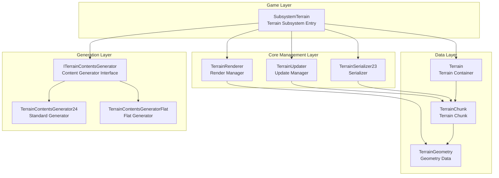

### 1.2 Core Module Responsibilities

| Module | Responsibility | Key Characteristics |
|--------|---------------|---------------------|
| **SubsystemTerrain** | Terrain system entry point, integrates all terrain functionality | Implements `IUpdateable` and `IDrawable`, manages raycasting and block change notifications |
| **Terrain** | Terrain data container, manages all Chunks | Uses a hash table to store Chunks, provides coordinate conversion and cell access interfaces |
| **TerrainChunk** | Terrain chunk, stores actual block data | 16×16×256 cells, contains Shaft data for temperature/humidity/height |
| **TerrainUpdater** | Terrain update manager | Multi-threaded updates, state machine driven, priority scheduling |
| **TerrainRenderer** | Terrain renderer | Multi-pass rendering (opaque/alpha-tested/transparent), supports fog fade-in |
| **TerrainSerializer23** | Terrain serializer | RLE compression + Deflate compression, region file storage |
| **ITerrainContentsGenerator** | Terrain content generator interface | Four-phase generation, supports different generation modes |

### 1.3 Chunk State Machine

The state transitions of terrain chunks are key to understanding the entire terrain system:

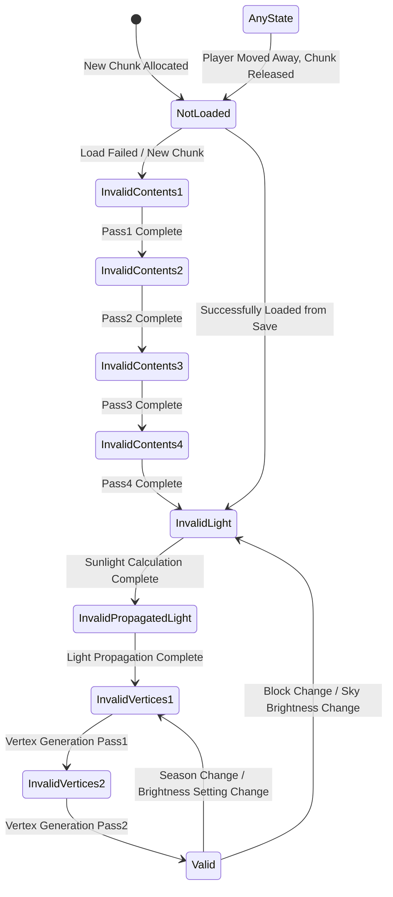

**State Descriptions**:

| State | Meaning | Trigger Condition |
|-------|---------|-------------------|
| `NotLoaded` | Not loaded | Chunk just allocated or load failed |
| `InvalidContents1-4` | Contents invalid (four phases) | Terrain contents need to be generated |
| `InvalidLight` | Lighting invalid | Sunlight and height need to be recalculated |
| `InvalidPropagatedLight` | Propagated lighting invalid | Light sources need to be propagated |
| `InvalidVertices1-2` | Vertices invalid | Render mesh needs to be regenerated |
| `Valid` | Fully valid | Can be rendered normally |

---

## 2. Core Data Structures

### 2.1 Terrain — Terrain Container

`Terrain` is the top-level container of the terrain system, responsible for managing all `TerrainChunk`s:

```cs
public class Terrain : IDisposable {
    // Chunk storage structure (open-addressing hash table)
    public class ChunksStorage {
        public const int Capacity = 65536;        // Maximum number of Chunks
        public TerrainChunk[] m_array;             // Hash table array
    }
    
    public ChunksStorage m_allChunks;              // Storage for all Chunks
    public HashSet<TerrainChunk> m_allocatedChunks; // Set of allocated Chunks
    
    // Cell value encoding constants
    public const int ContentsMask = 1023;    // Low 10 bits: block ID
    public const int LightMask = 15360;      // 4 bits: light value
    public const int DataMask = -16384;      // High 18 bits: block data
}
```

**Key Methods**:

- `GetChunkAtCell(x, y, z)` — Get Chunk by world coordinate
- `GetCellValue(x, y, z)` — Get full cell value (with bounds check)
- `GetCellValueFast(x, y, z)` — Fast cell value retrieval (no bounds check)
- `SetCellValueFast(x, y, z, value)` — Fast cell value set

**Coordinate Conversion**:

```cs
// World coordinate -> Chunk coordinate
chunkX = x >> TerrainChunk.SizeBits;  // SizeBits = 4
chunkZ = z >> TerrainChunk.SizeBits;

// World coordinate -> Local coordinate within Chunk
localX = x & 0xF;  // Equivalent to x % 16
localZ = z & 0xF;
```

### 2.2 TerrainChunk — Terrain Chunk

`TerrainChunk` is the core data unit of the terrain system:

```cs
public class TerrainChunk : IDisposable {
    // Size constants
    public const int SizeBits = 4;          // 16 = 2^4
    public const int Size = 16;             // Chunk horizontal size
    public const int HeightBits = 8;        // 256 = 2^8
    public const int Height = 256;          // Chunk height
    public const int SliceHeight = 16;      // Slice height
    public const int SlicesCount = 16;      // Number of slices (256/16)
    
    // Core data
    public Terrain Terrain;                 // Owning terrain
    public Point2 Coords;                   // Chunk coordinates
    public Point2 Origin;                   // World origin coordinates
    public BoundingBox BoundingBox;         // Bounding box
    
    // Block data (uses object pool cache)
    public int[] Cells;                     // 65,536 cell values
    public int[] Shafts;                    // 256 Shaft values (temperature/humidity/height)
    
    // Render data
    public TerrainChunkGeometry Geometry;
    public TerrainGeometry[] ChunkSliceGeometries; // 16 slice geometries
    public DynamicArray<TerrainChunkGeometry.Buffer> Buffers;
    
    // State
    public TerrainChunkState State;         // Main thread state
    public TerrainChunkState ThreadState;   // Update thread state
    public volatile bool NewGeometryData;   // New geometry data flag
}
```

**Cell Index Calculation**:

There are two implementations in the source code:

```cs
// Method 1: Bitwise (used by CalculateCellIndex, supports out-of-range Y)
public static int CalculateCellIndex(int x, int y, int z) {
    return y | (x << HeightBits) | (z << 12);  // HeightBits=8, 12=8+4
}

// Method 2: Multiplication (used by GetCellValueFast/SetCellValueFast)
public int GetCellValueFast(int x, int y, int z) {
    return Cells[y + x * Height + z * Height * Size];  // Height=256, Size=16
}
```

Both methods are mathematically equivalent.

**Shaft Value Encoding** (one per column, stores environmental information):

Shaft Value Bit Layout

| 31–24 | 23–16 | 15–12 | 11–8 | 7–0 |
|-------|-------|-------|------|-----|
| SunlightHeight | BottomHeight | Humidity | Temperature | TopHeight |

```cs
int shaftValue = GetShaftValue(x, z);
int topHeight = ExtractTopHeight(shaftValue);           // Surface height
int bottomHeight = ExtractBottomHeight(shaftValue);     // Bottom height
int sunlightHeight = ExtractSunlightHeight(shaftValue); // Sunlight penetration height
int temperature = ExtractTemperature(shaftValue);       // Temperature
int humidity = ExtractHumidity(shaftValue);             // Humidity
```

### 2.3 Cell Value Encoding

Each cell uses a 32-bit integer to store complete block information:

Cell Value Bit Layout

| 31–14 | 13–10 | 9–0 |
|-------|-------|-----|
| Data | Light | Contents |

```cs
int cellValue = GetCellValue(x, y, z);

// Extract data
int contents = Terrain.ExtractContents(cellValue);  // Block ID (0–1023)
int light = Terrain.ExtractLight(cellValue);        // Light value (0–15)
int data = Terrain.ExtractData(cellValue);          // Block data

// Build cell value
int value = Terrain.MakeBlockValue(contents, light, data);

// Replace individual fields
value = Terrain.ReplaceLight(cellValue, newLight);
value = Terrain.ReplaceContents(cellValue, newContents);
```

### 2.4 TerrainVertex — Terrain Vertex

```cs
public struct TerrainVertex {
    public float X, Y, Z;           // Position (12 bytes)
    public short Tx, Ty;            // Texture coordinates (4 bytes, normalized)
    public Color Color;             // Vertex color (4 bytes, includes lighting)
    
    // Vertex declaration
    public static readonly VertexDeclaration VertexDeclaration = new(
        new VertexElement(0, VertexElementFormat.Vector3, VertexElementSemantic.Position),
        new VertexElement(12, VertexElementFormat.NormalizedShort2, VertexElementSemantic.TextureCoordinate),
        new VertexElement(16, VertexElementFormat.NormalizedByte4, VertexElementSemantic.Color)
    );
}
```

**Vertex size**: 20 bytes per vertex

### 2.5 TerrainGeometry — Geometry Data

```cs
public class TerrainGeometry : IDisposable {
    // Seven subsets, categorized by render type and facing direction
    public TerrainGeometrySubset[] Subsets;  // 7 subsets
    
    // Convenient accessors
    public TerrainGeometrySubset SubsetOpaque;        // Opaque (subset 4)
    public TerrainGeometrySubset SubsetAlphaTest;     // Alpha-tested (subset 5)
    public TerrainGeometrySubset SubsetTransparent;   // Transparent (subset 6)
    
    // Opaque subsets by facing direction (used for face culling optimization)
    public TerrainGeometrySubset[] OpaqueSubsetsByFace;  // 6 directions
    
    // Multi-texture support
    public Dictionary<Texture2D, TerrainGeometry> Draws;
    public Texture2D DefaultTexture;
}
```

**Subset Classification**:

| Index | Type | Purpose |
|-------|------|---------|
| 0–3 | Opaque (by direction) | Face culling optimization |
| 4 | Opaque (general) | Blocks that don't need face culling |
| 5 | Alpha-tested | Leaves, fences, etc. |
| 6 | Transparent | Water, glass, etc. |

---

## 3. Terrain Update and Generation Mechanism

### 3.1 TerrainUpdater Architecture

`TerrainUpdater` is the core of terrain updates, using a multi-threaded architecture:

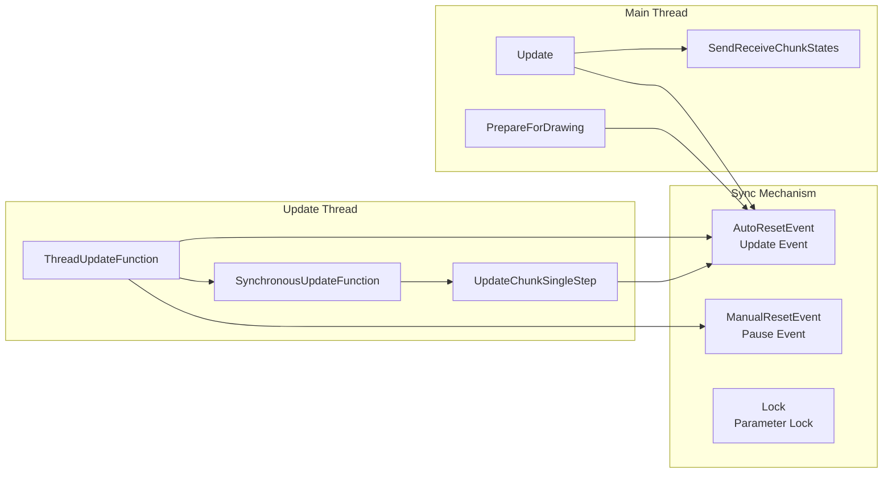

### 3.2 Update Location Management

The system supports multiple update locations (e.g., one per player in multiplayer):

```cs
public struct UpdateLocation {
    public Vector2 Center;                      // Update center
    public Vector2? LastChunksUpdateCenter;     // Last update center
    public float VisibilityDistance;            // Visibility distance
    public float ContentDistance;               // Content generation distance
}

// Set update location from main thread
SetUpdateLocation(playerIndex, center, visibilityDistance, contentDistance);
```

### 3.3 Chunk Allocation and Release

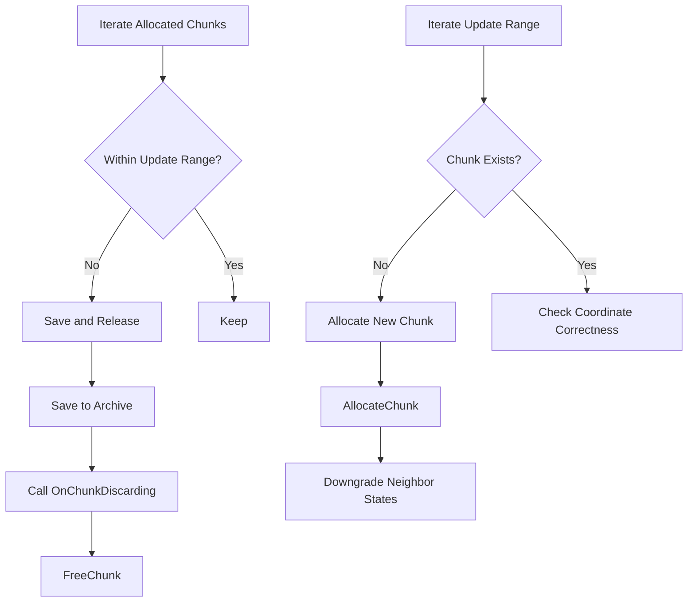

### 3.4 State Update Flow

**Single-Step Update (UpdateChunkSingleStep)**:

```cs
void UpdateChunkSingleStep(TerrainChunk chunk, int skylightValue) {
    switch (chunk.ThreadState) {
        case TerrainChunkState.NotLoaded:
            // Try to load from save
            if (TerrainSerializer.LoadChunk(chunk))
                chunk.ThreadState = TerrainChunkState.InvalidLight;
            else
                chunk.ThreadState = TerrainChunkState.InvalidContents1;
            break;
            
        case TerrainChunkState.InvalidContents1:
            TerrainContentsGenerator.GenerateChunkContentsPass1(chunk);
            chunk.ThreadState = TerrainChunkState.InvalidContents2;
            break;
            
        // ... other state handling
        
        case TerrainChunkState.InvalidVertices1:
            // Wait for neighbors to be ready
            CalculateChunkSliceContentsHashes(chunk);
            GenerateChunkVertices(chunk, 0);  // Odd slices, ultimately used for rendering
            chunk.ThreadState = TerrainChunkState.InvalidVertices2;
            break;
            
        case TerrainChunkState.InvalidVertices2:
            GenerateChunkVertices(chunk, 1);  // Even slices, ultimately used for rendering
            chunk.NewGeometryData = true;     // Notify renderer
            chunk.ThreadState = TerrainChunkState.Valid;
            break;
    }
}
```

### 3.5 Terrain Content Generation

The `ITerrainContentsGenerator` interface defines a four-phase generation process:

```cs
public interface ITerrainContentsGenerator {
    int OceanLevel { get; }
    
    // Environment queries
    Vector3 FindCoarseSpawnPosition();
    float CalculateOceanShoreDistance(float x, float z);
    float CalculateHeight(float x, float z);
    int CalculateTemperature(float x, float z);
    int CalculateHumidity(float x, float z);
    
    // Four-phase generation
    void GenerateChunkContentsPass1(TerrainChunk chunk);  // Terrain height, temperature, humidity
    void GenerateChunkContentsPass2(TerrainChunk chunk);  // Detail generation
    void GenerateChunkContentsPass3(TerrainChunk chunk);  // Caves, minerals
    void GenerateChunkContentsPass4(TerrainChunk chunk);  // Vegetation, decorations
}
```

**TerrainContentsGenerator24 Generation Steps**:

| Pass | Step | Content |
|------|------|---------|
| 1 | GenerateSurfaceParameters | Calculate temperature, humidity (upper half) |
| 1 | GenerateTerrain | Generate base terrain (upper half) |
| 2 | GenerateSurfaceParameters | Calculate temperature, humidity (lower half) |
| 2 | GenerateTerrain | Generate base terrain (lower half) |
| 3 | GenerateCaves | Generate caves |
| 3 | GeneratePockets | Generate dirt, gravel pockets, etc. |
| 3 | GenerateMinerals | Generate minerals (coal, iron, diamond, etc.) |
| 3 | GenerateSurface | Generate surface blocks |
| 3 | PropagateFluidsDownwards | Propagate fluids downward |
| 4 | GenerateGrassAndPlants | Generate grass and plants |
| 4 | GenerateTrees | Generate trees |
| 4 | GenerateSnowAndIce | Generate snow and ice |
| 4 | GenerateBedrockAndAir | Generate bedrock and air |

### 3.6 Lighting System

**Sunlight Calculation (GenerateChunkSunLightAndHeight)**:

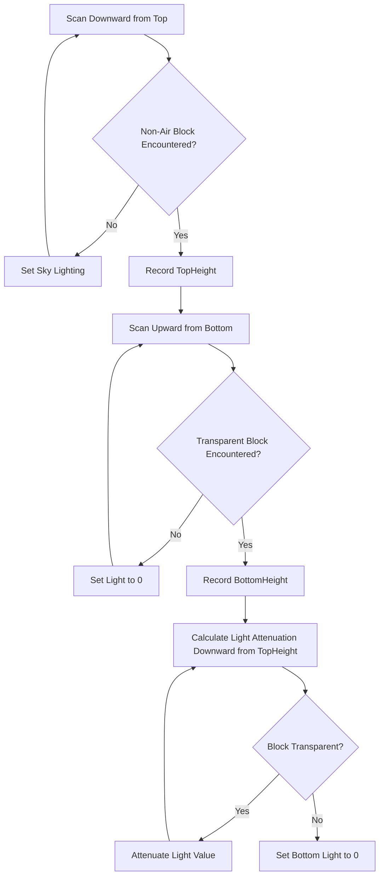

**Light Source Propagation**:

```cs
// Collect light sources
void GenerateChunkLightSources(TerrainChunk chunk) {
    // 1. Collect self-luminous block sources
    // 2. Collect light propagated from neighboring Chunks
}

// Propagate light sources
void PropagateLightSources() {
    foreach (var lightSource in m_lightSources) {
        // Propagate in 6 directions, attenuating through transparent blocks
        PropagateLightSource(x-1, y, z, light);
        PropagateLightSource(x+1, y, z, light);
        PropagateLightSource(x, y-1, z, light);
        PropagateLightSource(x, y+1, z, light);
        PropagateLightSource(x, y, z-1, light);
        PropagateLightSource(x, y, z+1, light);
    }
}
```

---

## 4. Terrain Editing Mechanism

### 4.1 TerrainBrush — Terrain Brush

`TerrainBrush` is used for bulk terrain editing and supports various shapes:

```cs
public class TerrainBrush {
    public struct Cell {
        public sbyte X, Y, Z;    // Relative coordinates
        public int Value;        // Block value
    }
    
    // Brush definition
    public class Brush {
        public int m_value;                    // Fixed value
        public Func<int?, int?> m_handler1;    // Handler based on current value
        public Func<Point3, int?> m_handler2;  // Handler based on position
    }
    
    // Counter
    public class Counter {
        public int m_value;                    // Target value
        public Func<int?, int> m_handler1;     // Counter based on current value
        public Func<Point3, int> m_handler2;   // Counter based on position
    }
    
    private Dictionary<int, Cell> m_cellsDictionary;  // Cell dictionary
    private Cell[] m_cells;                           // Compiled array
}
```

**Key Methods**:

```cs
// Add cells
AddCell(x, y, z, brush);
AddBox(x, y, z, sizeX, sizeY, sizeZ, brush);
AddRay(x1, y1, z1, x2, y2, z2, sizeX, sizeY, sizeZ, brush);

// Paint to terrain
PaintFast(chunk, x, y, z);                    // Direct paint
PaintFastSelective(chunk, x, y, z, onlyValue); // Selective paint
PaintFastAvoidWater(chunk, x, y, z);          // Paint avoiding water
Paint(subsystemTerrain, x, y, z);             // Paint with notifications
```

### 4.2 SubsystemTerrain Change Interface

```cs
// Modify a single block (with notification)
void ChangeCell(int x, int y, int z, int value, 
    bool updateModificationCounter = true, MovingBlock movingBlock = null) {
    
    // 1. Mod hook
    // 2. Bounds check
    // 3. Compare old value
    // 4. Set new value
    // 5. Increment modification counter
    // 6. Downgrade neighboring Chunk states
    // 7. Record modification location
    // 8. Trigger block behaviors
}

// Destroy block (with drops and particles)
void DestroyCell(int toolLevel, int x, int y, int z, int newValue,
    bool noDrop, bool noParticleSystem, MovingBlock movingBlock = null);
```

**Modification Notification Flow**:

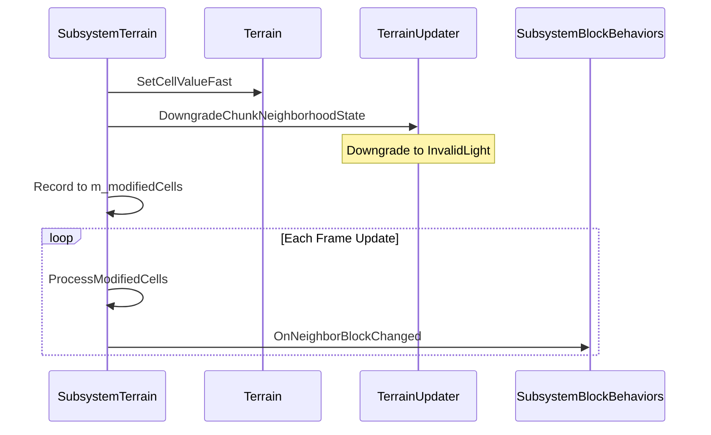

---

## 5. Terrain Rendering Mechanism

Triangle vertex data is generated in the `TerrainUpdater.GenerateChunkVertices` method, which calls `Block.GenerateTerrainVertices` for each block. To see how a specific block generates its vertex data, refer to that block's implementation of this method.

The following describes the specific flow of `TerrainRenderer`.

### 5.1 Rendering Flow

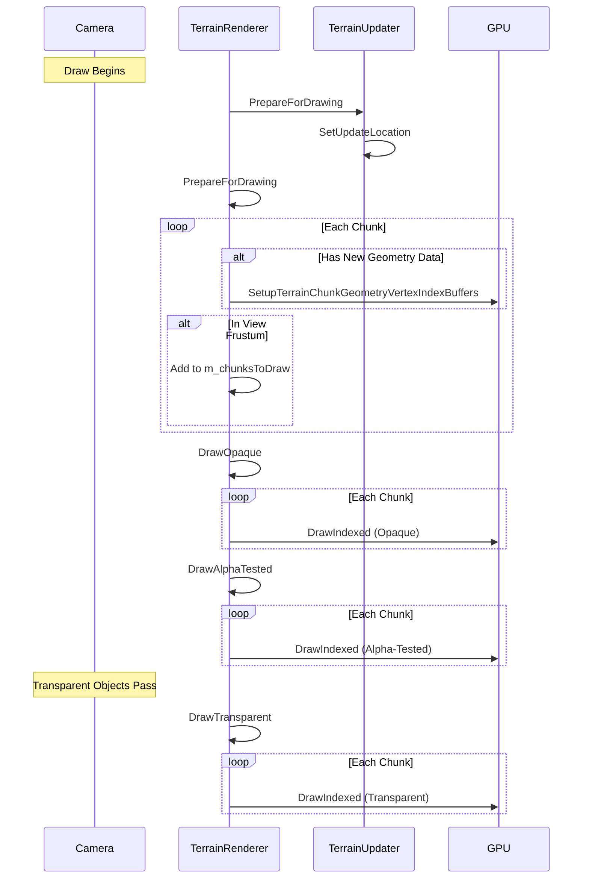

### 5.2 Geometry Data Compilation

```cs
static void CompileDrawSubsets(TerrainGeometry[] chunkSliceGeometries,
    DynamicArray<TerrainChunkGeometry.Buffer> buffers) {
    
    // 1. Count vertex/index counts per texture
    // 2. Create Buffers grouped by texture
    // 3. Set each subset's range within the Buffer
    // 4. Write vertex and index data to GPU Buffer
}
```

**Buffer Structure**:

```cs
public class Buffer : IDisposable {
    public VertexBuffer VertexBuffer;        // Vertex buffer
    public IndexBuffer IndexBuffer;          // Index buffer
    public Texture2D Texture;                // Associated texture
    
    // Ranges for seven subsets
    public int[] SubsetIndexBufferStarts = new int[7];
    public int[] SubsetIndexBufferEnds = new int[7];
    public int[] SubsetVertexBufferStarts = new int[7];
    public int[] SubsetVertexBufferEnds = new int[7];
}
```

### 5.3 Render States

| Pass | Blend Mode | Depth Test | Cull Mode | Shader |
|------|------------|------------|-----------|--------|
| DrawOpaque | Opaque | Read/Write | CCW Cull | Opaque.vsh/psh |
| DrawAlphaTested | Opaque | Read/Write | CCW Cull | AlphaTested.vsh/psh |
| DrawTransparent | AlphaBlend | Read/Write | CW when Underwater | Transparent.vsh/psh |

### 5.4 Face Culling Optimization

```cs
// Determine subsets to render based on camera position
int subsetsMask = 16;  // Render center subset by default

if (viewPosition.Z > chunk.BoundingBox.Min.Z) subsetsMask |= 1;  // +Z face
if (viewPosition.X > chunk.BoundingBox.Min.X) subsetsMask |= 2;  // +X face
if (viewPosition.Z < chunk.BoundingBox.Max.Z) subsetsMask |= 4;  // -Z face
if (viewPosition.X < chunk.BoundingBox.Max.X) subsetsMask |= 8;  // -X face

DrawTerrainChunkGeometrySubsets(shader, chunk, subsetsMask);
```

### 5.5 Chunk Fade-In Effect

```cs
// Start fade-in
void StartChunkFadeIn(Camera camera, TerrainChunk chunk) {
    // Calculate minimum distance from Chunk corners to camera
    float hazeEnd = Math.Min(distances);
    chunk.HazeEnds[gameWidgetIndex] = hazeEnd;
}

// Per-frame fade-in
void RunChunkFadeIn(Camera camera, TerrainChunk chunk) {
    chunk.HazeEnds[gameWidgetIndex] += 32f * Time.FrameDuration;
    if (hazeEnd >= VisibilityRange) {
        // Fade-in complete
    }
}
```

---

## 6. Terrain Serialization and Storage

### 6.1 Storage Architecture

The system supports two storage methods:

```cs
public interface IStorage : IDisposable {
    void Open(string directoryName, string suffix);
    int Load(Point2 coords, byte[] buffer);
    void Save(Point2 coords, byte[] buffer, int size);
}
```

| Storage Method | File Structure | Characteristics |
|----------------|----------------|-----------------|
| **SingleFileStorage** | Chunks32fs.dat | Single file, linked-list node structure |
| **RegionFileStorage** | Regions/Region X,Y.dat | Region files, 256 Chunks per file |

**RegionFileStorage is used by default**, with the following structure:

```
World/
└── Regions/
    ├── Region 0,0.dat     # Contains Chunks (0,0) to (15,15)
    ├── Region 0,1.dat
    ├── Region 1,0.dat
    └── ...
```

### 6.2 Data Compression


**RLE Encoding Format**:

```cs
// Short format (count ≤ 15): 4 bytes
// | Light = count-1 | Data | Contents |

// Long format (count > 15): 5 bytes
// | Light = 15 | Data | Contents | extraCount = count - 16 |
```

**Compression Example**:

```cs
int CompressChunkData(TerrainChunk chunk, byte[] buffer) {
    // 1. Write Shaft data (temperature/humidity)
    for (int i = 0; i < 16; i++) {
        for (int j = 0; j < 16; j++) {
            int shaft = chunk.GetShaftValueFast(i, j);
            buffer[pos++] = (byte)((temperature << 4) | humidity);
        }
    }
    
    // 2. RLE encode cell data
    // 3. Deflate compress
    return Deflate(compressBuffer, 0, pos, outputBuffer);
}
```

### 6.3 Incremental Saving

```cs
void SaveChunk(TerrainChunk chunk) {
    if (chunk.State > InvalidContents4 && chunk.ModificationCounter > 0) {
        SaveChunkData(chunk);
        chunk.ModificationCounter = 0;
    }
}
```

Only modified Chunks are saved, avoiding redundant writes.

---

## 7. Core Flowcharts

### 7.1 Complete Update Flow

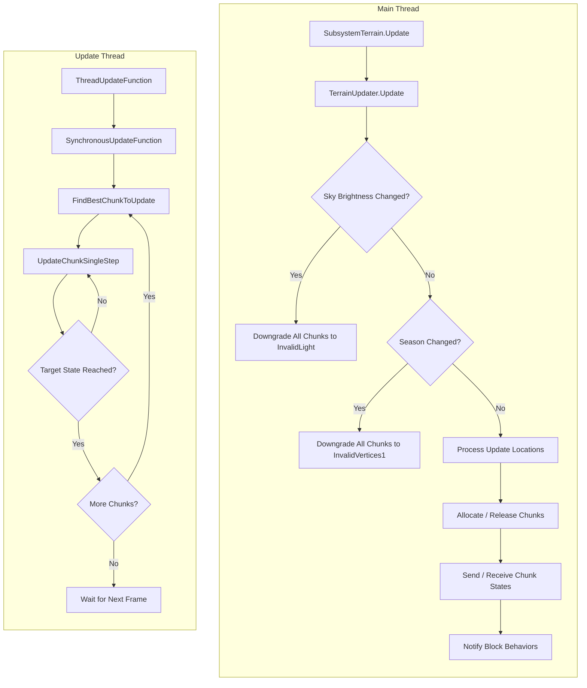

### 7.2 Chunk Lifecycle

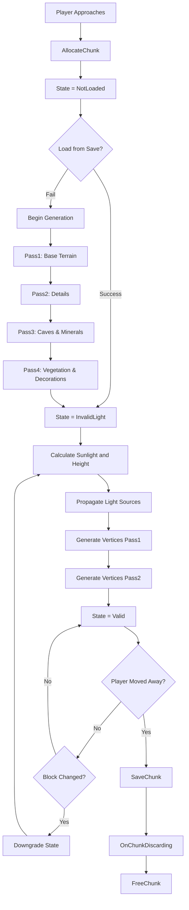

### 7.3 Block Change Flow

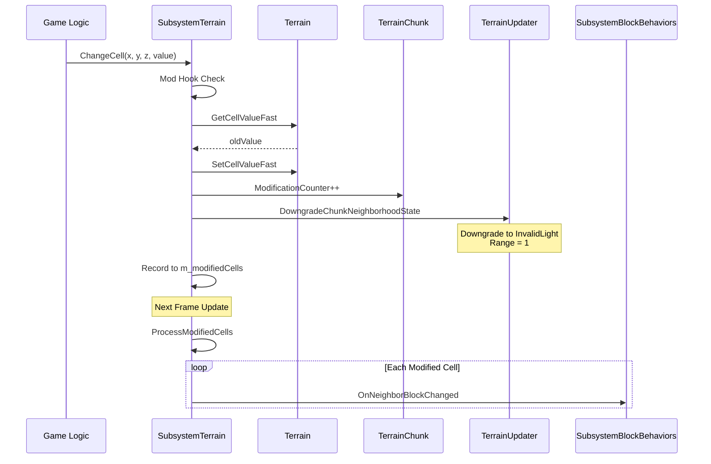

---

## Appendix: Key Class Relationship Diagram

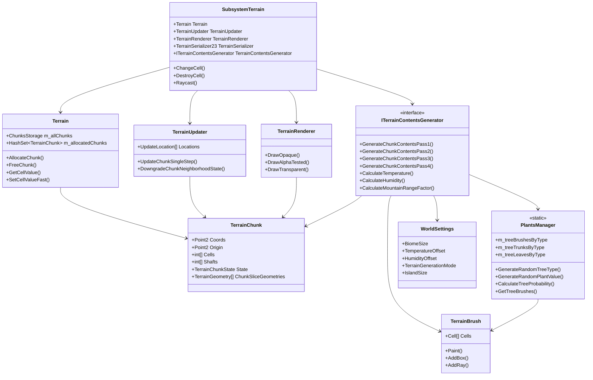

---

## 8. Biome Generation Mechanism

Survivalcraft has no explicit "Biome" class. Instead, it implicitly defines different terrain region types through combinations of **temperature, humidity, and mountain factor** parameters. This design allows for naturally smooth transitions between biomes.

### 8.1 Core Environmental Parameters

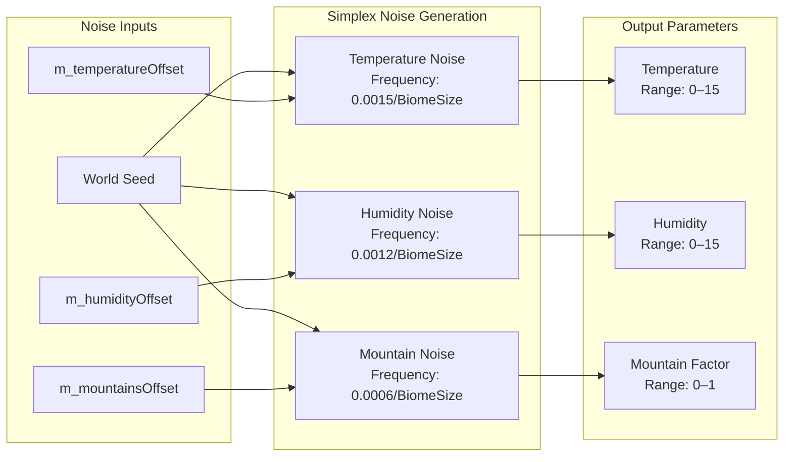

#### Parameter Calculation Formulas

```cs
// Temperature calculation (range 0–15)
int CalculateTemperature(float x, float z) {
    return Math.Clamp(
        (int)(MathUtils.Saturate(
            3f * SimplexNoise.OctavedNoise(
                x + m_temperatureOffset.X, 
                z + m_temperatureOffset.Y, 
                0.0015f / TGBiomeScaling,  // frequency
                5,                          // octave count
                2f,                         // amplitude multiplier
                0.6f                        // persistence
            ) - 1.1f + m_worldSettings.TemperatureOffset / 16f
        ) * 16f),
        0, 15
    );
}

// Humidity calculation (range 0–15)
int CalculateHumidity(float x, float z) {
    return Math.Clamp(
        (int)(MathUtils.Saturate(
            3f * SimplexNoise.OctavedNoise(
                x + m_humidityOffset.X, 
                z + m_humidityOffset.Y, 
                0.0012f / TGBiomeScaling,
                5, 2f, 0.6f
            ) - 0.9f + m_worldSettings.HumidityOffset / 16f
        ) * 16f),
        0, 15
    );
}

// Mountain factor calculation (range 0–1)
float CalculateMountainRangeFactor(float x, float z) {
    return SimplexNoise.OctavedNoise(
        x + m_mountainsOffset.X,
        z + m_mountainsOffset.Y,
        TGMountainRangeFreq / TGBiomeScaling,  // default 0.0006/BiomeSize
        3, 1.91f, 0.75f, true
    );
}
```

#### Adjustable Parameters (WorldSettings)

| Parameter | Description | Default |
|-----------|-------------|---------|
| `BiomeSize` | Biome size multiplier | 1.0 |
| `TemperatureOffset` | Global temperature offset | 0 |
| `HumidityOffset` | Global humidity offset | 0 |

### 8.2 Biome Types and Conditions

The game implicitly defines the following biome types through parameter combinations:

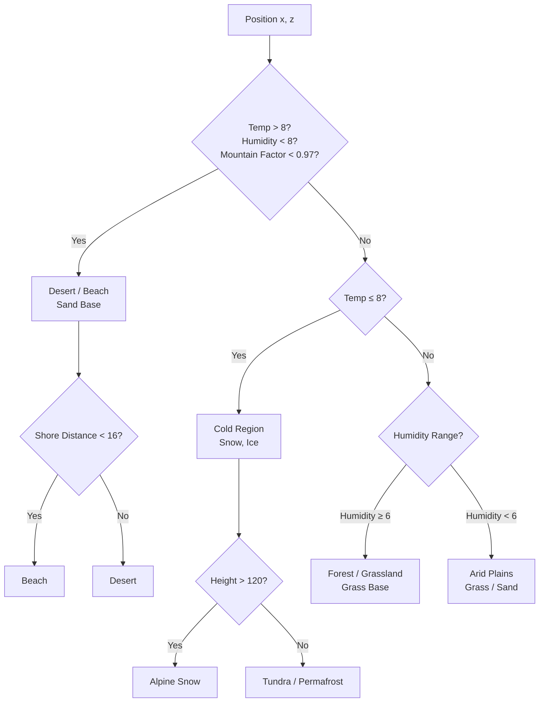

#### Biome Determination Logic

| Biome | Temperature | Humidity | Mountain Factor | Other Conditions |
|-------|-------------|----------|-----------------|------------------|
| **Desert** | > 8 | < 8 | < 0.97 | Distance to ocean > 16 blocks |
| **Beach** | > 8 | < 8 | < 0.97 | Distance to ocean ≤ 16 blocks |
| **Tundra** | ≤ 8 | Any | Any | Height ≤ 120 |
| **Alpine Snow** | ≤ 8 | Any | Any | Height > 120 |
| **Forest** | 4–15 | ≥ 6 | < 0.9 | — |
| **Grassland** | 4–15 | ≥ 6 | ≥ 0.9 | — |
| **Arid Plains** | > 4 | < 6 | < 0.9 | — |

### 8.3 Surface Block Generation

In the `GenerateSurface` method, the surface block type is determined by environmental parameters:

```cs
void GenerateSurface(TerrainChunk chunk) {
    // Iterate over each horizontal position
    for (int i = 0; i < 16; i++) {
        for (int j = 0; j < 16; j++) {
            int temperature = terrain.GetTemperature(x, z);
            int humidity = terrain.GetHumidity(x, z);
            
            // Determine surface block based on temperature and height
            if (height > 120 && IsPlaceFrozen(temperature, height)) {
                surfaceBlock = 62;  // Ice
            }
            else if (temperature > 4 && temperature < 7) {
                surfaceBlock = 6;   // Gravel (transition zone)
            }
            else {
                surfaceBlock = 7;   // Sand (desert)
            }
            // ... more conditions
        }
    }
}
```

**Block ID Reference**:

| ID | Block | Generation Condition |
|----|-------|----------------------|
| 2 | Grass | Default surface |
| 3 | Dirt | Underground |
| 4 | Sand | Desert / Coast |
| 6 | Gravel | Transition zone |
| 7 | Sand (Desert) | High temp, low humidity |
| 8 | Grass (Tall) | High humidity |
| 61 | Snow | Cold surface |
| 62 | Ice | Cold water body |
| 66 | Sandstone | Special conditions |
| 72 | Wet Sand | Near water |

### 8.4 Vegetation Generation

Vegetation generation occurs in Pass 4, selecting appropriate vegetation types based on temperature and humidity.

#### Tree Type Selection

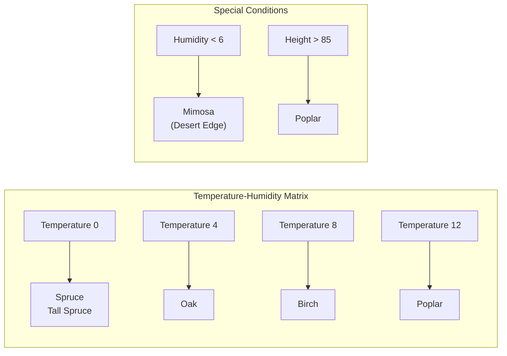

#### Tree Generation Probability Function

`PlantsManager.CalculateTreeProbability` defines the spawn probability for each tree type:

| Tree Type | Temperature Range | Humidity Range | Height Range | Notes |
|-----------|-------------------|----------------|--------------|-------|
| **Oak** | 4–10 optimal | 6+ | < 82 | Warm, humid regions |
| **Birch** | 5–11 | Any | < 82 | Temperate regions |
| **Spruce** | 0–6 (cold) | 3–12 | Any | Cold regions |
| **Tall Spruce** | 0–6 | 9–15 | < 95 | High-altitude, humid, cold |
| **Mimosa** | 2–12 | 0–4 | Any | Dry, warm regions |
| **Poplar** | 4–12 | 3+ | 85–92 | Mid-to-high altitude |

```cs
// Probability calculation example: Oak
float CalculateTreeProbability(TreeType.Oak, int temperature, int humidity, int y) {
    return RangeProbability(temperature, 4f, 10f, 15f, 15f)  // Temperature 4–10 optimal
         * RangeProbability(humidity, 6f, 8f, 15f, 15f)      // Humidity 6+ optimal
         * RangeProbability(y, 0f, 0f, 82f, 87f);            // Height < 82
}

// RangeProbability: Trapezoidal probability function
// v < a: 0
// a <= v < b: Linear rise 0→1
// b <= v <= c: 1 (optimal zone)
// c < v <= d: Linear fall 1→0
// v > d: 0
```

#### Other Vegetation Generation

| Vegetation Type | Condition | Notes |
|-----------------|-----------|-------|
| **Tall Grass** | Humidity ≥ 6 | Grassy surface |
| **Flowers** | Humidity ≥ 6, random | Low probability |
| **Cactus** | Temperature > 8, Humidity < 6 | Desert regions |
| **Pumpkin** | Temperature > 6, Humidity ≥ 10 | Humid regions |
| **Seagrass / Kelp** | Near shore | Underwater vegetation |
| **Ivy** | Temperature ≥ 10, Humidity ≥ 10 | Tropical humid regions |

### 8.5 Snow and Ice Generation

Handled in the `GenerateSnowAndIce` method:

```cs
void GenerateSnowAndIce(TerrainChunk chunk) {
    for (int i = 0; i < 16; i++) {
        for (int j = 0; j < 16; j++) {
            int temperature = chunk.GetTemperatureFast(i, j);
            
            // Check if frozen (temperature ≤ 8 and sufficient height)
            if (!SubsystemWeather.IsPlaceFrozen(temperature, height)) {
                continue;
            }
            
            if (block is WaterBlock) {
                // Freeze water surface
                chunk.SetCellValueFast(i, height, j, 62);  // Ice
                // Possibly cover with snow
                if (ShaftHasSnowOnIce(x, z)) {
                    chunk.SetCellValueFast(i, height + 1, j, 61);  // Snow
                }
            }
            else if (CanSupportSnow(block)) {
                // Cover land with snow
                chunk.SetCellValueFast(i, height + 1, j, 61);  // Snow
            }
        }
    }
}
```

### 8.6 Biome Transitions and Smoothing

Because continuous noise functions are used, biomes transition naturally into one another:

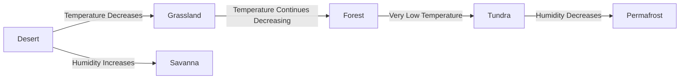

**Key Transition Parameters**:
- `TGBiomeScaling`: Controls noise frequency; higher values produce larger biomes
- `m_temperatureOffset` / `m_humidityOffset`: Random offsets that ensure each world has a unique biome distribution

### 8.7 Terrain Height and Biome Relationship

```cs
float CalculateHeight(float x, float z) {
    float mountainFactor = CalculateMountainRangeFactor(x, z);
    
    // Mountain factor influences terrain height
    float hillsStrength = TGHillsStrength * Squish(mountainFactor, 0.72f, 0.89f);
    float mountainsStrength = TGMountainsStrength * Squish(mountainFactor, 0.89f, 1.0f);
    
    // Humidity influence (high humidity lowers mountains)
    float humidityFactor = mountainFactor - 0.01f * humidity;
    
    // Final height
    return baseHeight + hillsStrength * hillsNoise + mountainsStrength * mountainsNoise;
}
```

### 8.8 Mod Extension Points

Mods can customize biomes in the following ways:

1. **TerrainContentsGenerator24Initialize hook**: Modify generation parameters
   ```cs
   public override void TerrainContentsGenerator24Initialize(
       TerrainContentsGenerator24 generator, SubsystemTerrain subsystemTerrain) {
       // Modify parameters
       generator.TGBiomeScaling = 2.0f;  // Larger biomes
       generator.TGHillsStrength = 50f;  // Taller hills
   }
   ```

2. **Add new ChunkGenerationStep**:
   ```cs
   generator.ChunkGenerationStep4.Add(
       new ChunkGenerationStep(1500, chunk => GenerateCustomBiome(chunk))
   );
   ```

3. **PlantsManager extension**: Add new tree types

---

## Summary

Survivalcraft's terrain system is a carefully designed, high-performance voxel engine with the following characteristics:

1. **Layered architecture**: Data, management, and generation layers have clearly defined responsibilities
2. **State machine driven**: Chunks use state transitions for progressive loading
3. **Multi-threaded updates**: Main and update threads synchronize via events
4. **Efficient storage**: RLE + Deflate compression, organized into region files
5. **Flexible rendering**: Multi-pass rendering supports various materials and transparency modes
6. **Implicit biomes**: Natural biome transitions achieved through temperature / humidity / mountain factor combinations

Understanding these core mechanisms is valuable for mod development, performance optimization, or feature extension.
