!!! info inline end "Attribution"

    This text is derived and translated to English from [`docs/UiSystem.md`](https://gitee.com/SC-SPM/SurvivalcraftApi/blob/SCAPI1.9/docs/UiSystem.md) from the Survivalcraft API Gitee Repository.

This document provides a detailed explanation of Survivalcraft's UI system, with a focus on component layout mechanics, container widget implementation, and the layout process.

## 1. Overview

### 1.1 Overall UI System Architecture

The game's UI system uses a classic **two-phase layout model** (Measure-Arrange), similar to WPF/UWP layout systems. The entire UI is organized as a tree structure, with `RootWidget` as the root node. All UI elements inherit from the `Widget` base class.

### 1.2 Relationship Between Screen, Dialog, and Widget

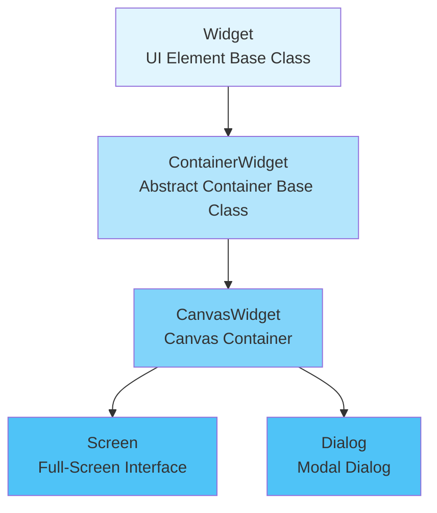
```mermaid
graph TB
    W[Widget<br/>UI Element Base Class]
    CW[ContainerWidget<br/>Abstract Container Base Class]
    CV[CanvasWidget<br/>Canvas Container]
    S[Screen<br/>Full-Screen Interface]
    D[Dialog<br/>Modal Dialog]
    
    W --> CW
    CW --> CV
    CV --> S
    CV --> D
    
    style W fill:#e1f5fe
    style CW fill:#b3e5fc
    style CV fill:#81d4fa
    style S fill:#4fc3f7
    style D fill:#4fc3f7
```

**Inheritance hierarchy:**

| Class | Inherits From | Responsibility |
|---|--------|------|
| `Widget` | - | Base class for all UI elements; provides infrastructure for layout, drawing, and input handling |
| `ContainerWidget` | `Widget` | Abstract base class for containers that can hold child elements; provides default child traversal and arrangement logic |
| `CanvasWidget` | `ContainerWidget` | Canvas container supporting absolute positioning; children can have their position set via `SetPosition()` |
| `Screen` | `CanvasWidget` | Full-screen interface with `Enter()`/`Leave()` lifecycle methods, managed by `ScreensManager` |
| `Dialog` | `CanvasWidget` | Modal dialog that fills its parent container by default, managed by `DialogsManager` |

**Core differences between the three:**

| Feature | Widget | Screen | Dialog |
|------|--------|--------|--------|
| **Role** | UI element base class | Full-screen interface state | Modal overlay layer |
| **Lifecycle** | None | `Enter()` / `Leave()` | None |
| **Manager** | None | `ScreensManager` | `DialogsManager` |
| **Display Mode** | As a child element | Occupies the entire screen, history-stack navigation | Overlaid on top of the current Screen |
| **Overlay Mask** | None | None | Semi-transparent black mask (CoverWidget) |
| **Animation** | Custom | Fade in/out on switch | Scale animation on show/hide |

## 2. Screen and Dialog System

### 2.1 Screen — Full-Screen Interface

`Screen` is the base class for full-screen interfaces. Each full-screen interface generally has only one instance and is managed by `ScreensManager`.  
It defines two lifecycle methods:

```csharp
public class Screen : CanvasWidget {
    public virtual void Enter(object[] parameters) { }  // Called when entering the screen
    public virtual void Leave() { }                      // Called when leaving the screen
}
```

**Main Screen implementations:**

| Screen Class | Purpose |
|-----------|------|
| `MainMenuScreen` | Main menu |
| `GameScreen` | World list and gameplay |
| `LoadingScreen` | Game loading |
| `GameLoadingScreen` | Save file loading |
| `SettingsScreen` | Settings interface |

### 2.2 Dialog — Modal Dialog

`Dialog` is the base class for modal dialogs. It is typically instantiated on demand and managed by `DialogsManager`.

```csharp
public class Dialog : CanvasWidget {
    public Dialog() {
        IsHitTestVisible = true;
        Size = new Vector2(1f / 0f);  // float.PositiveInfinity — fills the entire parent container
    }
}
```

**Main Dialog implementations:**

| Dialog Class | Purpose |
|-----------|------|
| `MessageDialog` | Message/notification dialog |
| `GameMenuDialog` | In-game pause menu |
| `BusyDialog` | Loading/busy wait dialog |
| `ListSelectionDialog` | List selection dialog |
| `TextBoxDialog` | Text input dialog |

### 2.3 ScreensManager — Full-Screen Interface Manager

`ScreensManager` is a static class responsible for managing Screen registration, switching, navigation history, and transition animations.

**Core data structures:**

```csharp
public static class ScreensManager {
    static Dictionary<string, Screen> m_screens = [];   // Registered screens
    static AnimationData m_animationData;               // Current animation data
    
    public static ContainerWidget RootWidget { get; set; }  // UI root container
    public static Screen CurrentScreen { get; set; }        // Current screen
    public static Screen PreviousScreen { get; set; }       // Previous screen
    public static Stack<Screen> HistoryStack { get; }       // Navigation history stack
}
```

**Screen transition flow:**

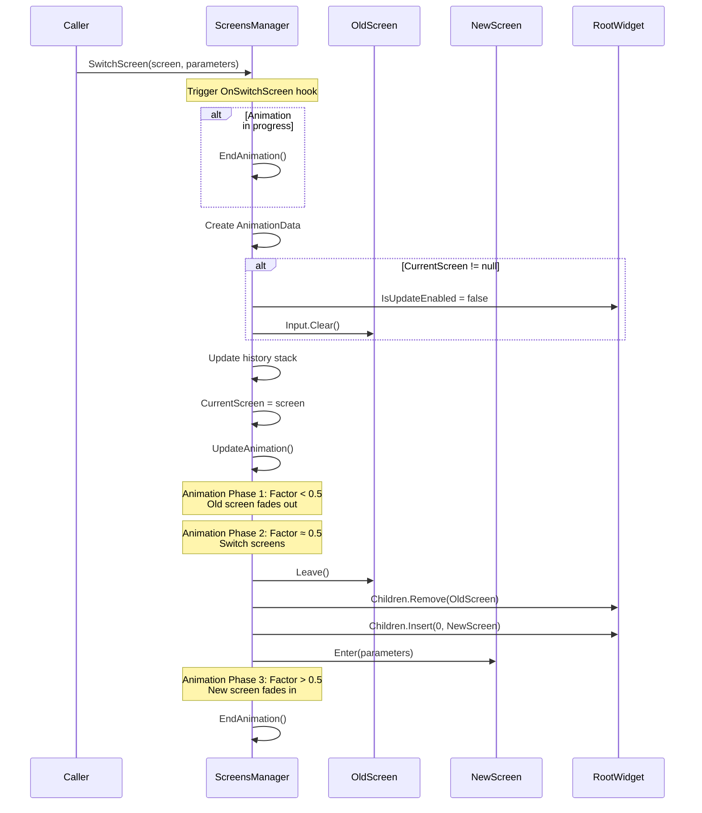
```mermaid
sequenceDiagram
    participant Caller as Caller
    participant SM as ScreensManager
    participant Old as OldScreen
    participant New as NewScreen
    participant RW as RootWidget
    
    Caller->>SM: SwitchScreen(screen, parameters)
    
    Note over SM: Trigger OnSwitchScreen hook
    
    alt Animation in progress
        SM->>SM: EndAnimation()
    end
    
    SM->>SM: Create AnimationData
    
    alt CurrentScreen != null
        SM->>RW: IsUpdateEnabled = false
        SM->>Old: Input.Clear()
    end
    
    SM->>SM: Update history stack
    SM->>SM: CurrentScreen = screen
    SM->>SM: UpdateAnimation()
    
    Note over SM: Animation Phase 1: Factor < 0.5<br/>Old screen fades out
    
    Note over SM: Animation Phase 2: Factor ≈ 0.5<br/>Switch screens
    
    SM->>Old: Leave()
    SM->>RW: Children.Remove(OldScreen)
    SM->>RW: Children.Insert(0, NewScreen)
    SM->>New: Enter(parameters)
    
    Note over SM: Animation Phase 3: Factor > 0.5<br/>New screen fades in
    
    SM->>SM: EndAnimation()
```

**Transition animation mechanism:**

The transition animation has three phases (`Factor` goes from 0 to 1):

1. **Factor < 0.5**: Old screen fades out
   - Opacity transitions from 1 to 0
   - Optional scale transform

2. **Factor ≈ 0.5**: Actual switch
   - Calls the old screen's `Leave()`
   - Removes the old screen from `RootWidget`
   - Adds the new screen to `RootWidget`
   - Calls the new screen's `Enter(parameters)`

3. **Factor > 0.5**: New screen fades in
   - Opacity transitions from 0 to 1

**Navigation history stack:**

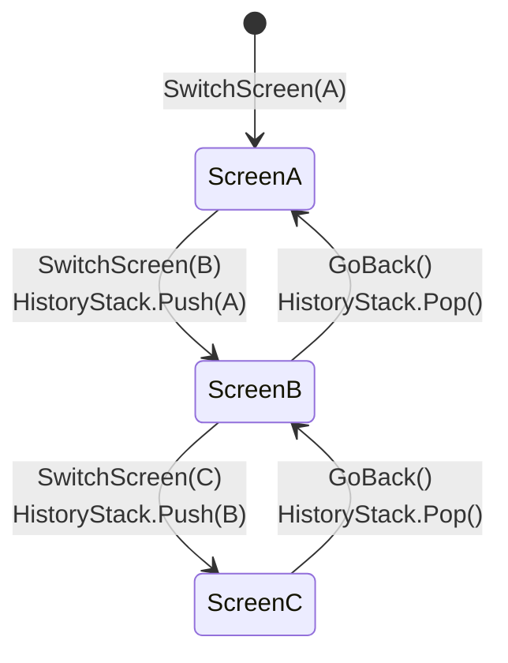
```mermaid
stateDiagram-v2
    [*] --> ScreenA: SwitchScreen(A)
    ScreenA --> ScreenB: SwitchScreen(B)<br/>HistoryStack.Push(A)
    ScreenB --> ScreenC: SwitchScreen(C)<br/>HistoryStack.Push(B)
    ScreenC --> ScreenB: GoBack()<br/>HistoryStack.Pop()
    ScreenB --> ScreenA: GoBack()<br/>HistoryStack.Pop()
```

### 2.4 DialogsManager — Dialog Manager

`DialogsManager` is a static class responsible for managing Dialog display, hiding, and animation effects.

**Core data structures:**

```csharp
public static class DialogsManager {
    static Dictionary<Dialog, AnimationData> m_animationData = [];  // Dialog animation data
    static List<Dialog> m_dialogs = [];          // List of currently displayed Dialogs
    static List<Dialog> m_toRemove = [];         // Pending removal list
    
    public class AnimationData {
        public float Factor;        // Animation progress factor (0~1)
        public int Direction;       // Direction: 1 = show, -1 = hide
        public CoverWidget CoverWidget;  // Overlay mask
    }
}
```

**Dialog show flow:**

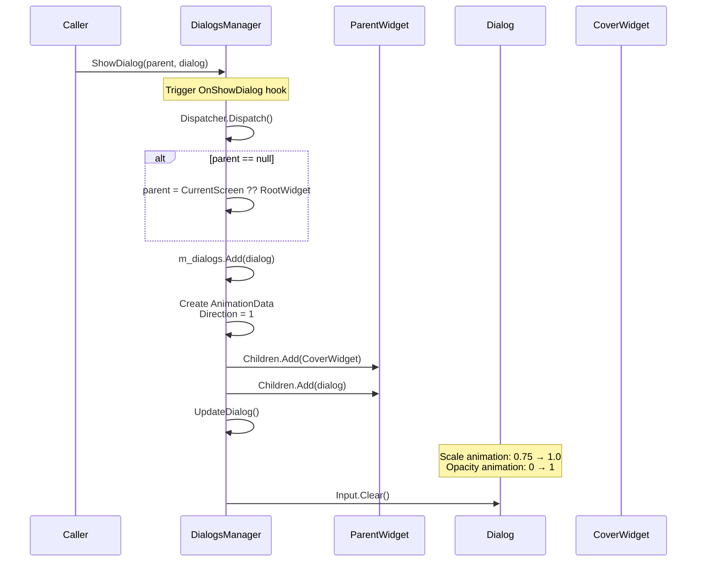
```mermaid
sequenceDiagram
    participant Caller as Caller
    participant DM as DialogsManager
    participant Parent as ParentWidget
    participant Dialog as Dialog
    participant Cover as CoverWidget
    
    Caller->>DM: ShowDialog(parent, dialog)
    
    Note over DM: Trigger OnShowDialog hook
    
    DM->>DM: Dispatcher.Dispatch()
    
    alt parent == null
        DM->>DM: parent = CurrentScreen ?? RootWidget
    end
    
    DM->>DM: m_dialogs.Add(dialog)
    DM->>DM: Create AnimationData<br/>Direction = 1
    
    DM->>Parent: Children.Add(CoverWidget)
    DM->>Parent: Children.Add(dialog)
    
    DM->>DM: UpdateDialog()
    
    Note over Dialog: Scale animation: 0.75 → 1.0<br/>Opacity animation: 0 → 1
    
    DM->>Dialog: Input.Clear()
```

**Dialog hide flow:**

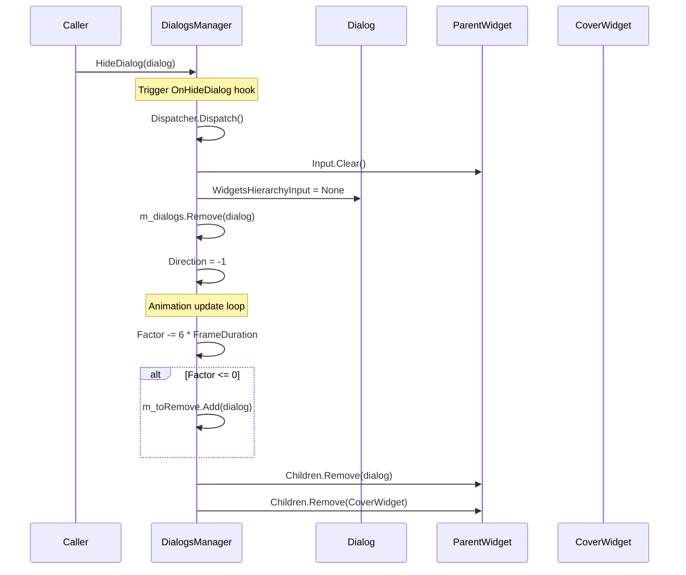
```mermaid
sequenceDiagram
    participant Caller as Caller
    participant DM as DialogsManager
    participant Dialog as Dialog
    participant Parent as ParentWidget
    participant Cover as CoverWidget
    
    Caller->>DM: HideDialog(dialog)
    
    Note over DM: Trigger OnHideDialog hook
    
    DM->>DM: Dispatcher.Dispatch()
    
    DM->>Parent: Input.Clear()
    DM->>Dialog: WidgetsHierarchyInput = None
    DM->>DM: m_dialogs.Remove(dialog)
    DM->>DM: Direction = -1
    
    Note over DM: Animation update loop
    
    DM->>DM: Factor -= 6 * FrameDuration
    
    alt Factor <= 0
        DM->>DM: m_toRemove.Add(dialog)
    end
    
    DM->>Parent: Children.Remove(dialog)
    DM->>Parent: Children.Remove(CoverWidget)
```

**Overlay mask (CoverWidget) mechanism:**

Each Dialog is associated with a `CoverWidget`, which is a semi-transparent black rectangle (`FillColor = Color(0, 0, 0, 192)`). It serves the following purposes:

1. **Modal mask**: Prevents the user from interacting with the underlying Screen
2. **Visual feedback**: Provides a semi-transparent background to highlight the Dialog
3. **Click-to-close**: Has `IsHitTestVisible = true`, allowing click events to be detected

## 3. Core Layout System Concepts

### 3.1 Measure-Arrange Two-Phase Layout Model

The layout process is divided into two phases:

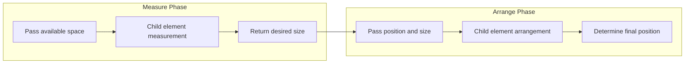
```mermaid
flowchart LR
    subgraph Measure Phase
        M1[Pass available space] --> M2[Child element measurement]
        M2 --> M3[Return desired size]
    end
    
    subgraph Arrange Phase
        A1[Pass position and size] --> A2[Child element arrangement]
        A2 --> A3[Determine final position]
    end
    
    M3 --> A1
```

**Measure phase:**
- The parent passes **available space** (`parentAvailableSize`) to each child
- The child calculates its **desired size** (`DesiredSize`) based on content and constraints
- Returns the desired size to the parent

**Arrange phase:**
- The parent determines each child's **actual position and size** based on the child's desired size and its own layout strategy
- The child receives its position and size, then computes its global transform matrix and bounds

### 3.2 Key Properties

| Property | Description |
|------|------|
| `DesiredSize` | The widget's desired size, computed during the Measure phase |
| `ParentDesiredSize` | The desired size after accounting for LayoutTransform, used by the parent element |
| `ActualSize` | The widget's actual size, determined during the Arrange phase |
| `GlobalBounds` | The widget's bounding rectangle in screen coordinates |
| `Margin` | The widget's outer margin (Left, Top, Right, Bottom) |

### 3.3 Alignment

The `WidgetAlignment` enum defines four alignment options:

```csharp
public enum WidgetAlignment {
    Near,     // Near-edge alignment (left/top)
    Center,   // Center alignment
    Far,      // Far-edge alignment (right/bottom)
    Stretch   // Stretch to fill
}
```

**Alignment behavior illustration:**

```
┌─────────────────────────────┐
│ Near                        │  ← Left/Top aligned
├─────────────────────────────┤
│         Center              │  ← Center aligned
├─────────────────────────────┤
│                       Far   │  ← Right/Bottom aligned
├─────────────────────────────┤
│─────────────────────────────│  ← Stretch to fill
└─────────────────────────────┘
```

### 3.4 Layout Direction

The `LayoutDirection` enum defines two layout directions:

```csharp
public enum LayoutDirection {
    Horizontal,  // Horizontal direction
    Vertical     // Vertical direction
}
```

## 4. Widget Base Class Implementation

### 4.1 Layout Entry Point

`LayoutWidgetsHierarchy` is the static entry method for layout:

```csharp
public static void LayoutWidgetsHierarchy(Widget rootWidget, Vector2 availableSize) {
    rootWidget.Measure(availableSize);           // Measure phase
    rootWidget.Arrange(Vector2.Zero, availableSize);  // Arrange phase
}
```

### 4.2 Measure Method

```csharp
public virtual void Measure(Vector2 parentAvailableSize) {
    MeasureOverride(parentAvailableSize);  // Subclasses override to customize measurement logic
    
    // Account for LayoutTransform's effect on desired size
    if (DesiredSize.X != float.PositiveInfinity && DesiredSize.Y != float.PositiveInfinity) {
        BoundingRectangle boundingRectangle = TransformBoundsToParent(DesiredSize);
        m_parentDesiredSize = boundingRectangle.Size();
        m_parentOffset = -boundingRectangle.Min;
    } else {
        m_parentDesiredSize = DesiredSize;
        m_parentOffset = Vector2.Zero;
    }
}

public virtual void MeasureOverride(Vector2 parentAvailableSize) { }
```

### 4.3 Arrange Method

```csharp
public virtual void Arrange(Vector2 position, Vector2 parentActualSize) {
    // Compute actual size (accounting for LayoutTransform)
    m_actualSize = ...;
    
    // Compute global color transform
    m_globalColorTransform = ParentWidget != null 
        ? ParentWidget.m_globalColorTransform * m_colorTransform 
        : m_colorTransform;
    
    // Compute global transform matrix
    if (m_isRenderTransformIdentity) {
        m_globalTransform = m_layoutTransform;
    } else {
        m_globalTransform = m_renderTransform * m_layoutTransform;
    }
    m_globalTransform.M41 += position.X + m_parentOffset.X;
    m_globalTransform.M42 += position.Y + m_parentOffset.Y;
    if (ParentWidget != null) {
        m_globalTransform *= ParentWidget.GlobalTransform;
    }
    
    // Compute global bounds
    m_globalBounds = TransformBoundsToGlobal(m_actualSize);
    
    ArrangeOverride();  // Subclasses override to customize arrangement logic
}

public virtual void ArrangeOverride() { }
```

### 4.4 Transform Matrices

Widgets support two types of transform matrices:

| Transform | Description | Affected Phase |
|------|------|----------|
| `LayoutTransform` | Layout transform | Measure and Arrange |
| `RenderTransform` | Render transform | Draw only |

**Global transform matrix computation order:**

```
GlobalTransform = RenderTransform × LayoutTransform × ParentGlobalTransform
```

## 5. ContainerWidget Container Base Class

`ContainerWidget` is the abstract base class for all container components, providing child element management and default layout behavior.

### 5.1 Child Element Management

```csharp
public abstract class ContainerWidget : Widget {
    public readonly WidgetsList Children;  // Child element collection
    
    public IEnumerable<Widget> AllChildren { get; }  // Recursively gets all child elements
}
```

`WidgetsList` is a dedicated child element collection class that automatically sets the `ParentWidget` property when children are added or removed.

### 5.2 Default Measure Behavior

```csharp
public override void MeasureOverride(Vector2 parentAvailableSize) {
    foreach (Widget child in Children) {
        child.Measure(Vector2.Max(
            parentAvailableSize - child.MarginHorizontalSumAndVerticalSum, 
            Vector2.Zero
        ));
    }
}
```

Default behavior: iterates all child elements and passes the available space minus their margins.

### 5.3 Default Arrange Behavior

```csharp
public override void ArrangeOverride() {
    foreach (Widget child in Children) {
        ArrangeChildWidgetInCell(Vector2.Zero, ActualSize, child);
    }
}
```

Default behavior: iterates all child elements and arranges them using the container's entire area.

### 5.4 ArrangeChildWidgetInCell Method — Detailed Explanation

This is the core method for arranging child elements within a container, handling alignment logic:

```csharp
public static void ArrangeChildWidgetInCell(Vector2 c1, Vector2 c2, Widget widget) {
    // c1: top-left corner of the cell, c2: bottom-right corner of the cell
    Vector2 cellSize = c2 - c1;
    Vector2 desiredSize = widget.ParentDesiredSize;
    
    // Clamp desired size to not exceed the cell size
    if (float.IsPositiveInfinity(desiredSize.X) || desiredSize.X > cellSize.X - widget.MarginHorizontalSum) {
        desiredSize.X = MathUtils.Max(cellSize.X - widget.MarginHorizontalSum, 0f);
    }
    if (float.IsPositiveInfinity(desiredSize.Y) || desiredSize.Y > cellSize.Y - widget.MarginVerticalSum) {
        desiredSize.Y = MathUtils.Max(cellSize.Y - widget.MarginVerticalSum, 0f);
    }
    
    // Horizontal alignment
    Vector2 position, size;
    switch (widget.HorizontalAlignment) {
        case WidgetAlignment.Near:
            position.X = c1.X + widget.MarginLeft;
            size.X = desiredSize.X;
            break;
        case WidgetAlignment.Center:
            position.X = c1.X + (cellSize.X - desiredSize.X) / 2f;
            size.X = desiredSize.X;
            break;
        case WidgetAlignment.Far:
            position.X = c2.X - desiredSize.X - widget.MarginRight;
            size.X = desiredSize.X;
            break;
        case WidgetAlignment.Stretch:
            position.X = c1.X + widget.MarginLeft;
            size.X = MathUtils.Max(cellSize.X - widget.MarginHorizontalSum, 0f);
            break;
    }
    
    // Vertical alignment (similar logic)...
    
    widget.Arrange(position, size);
}
```

**Alignment logic flowchart:**

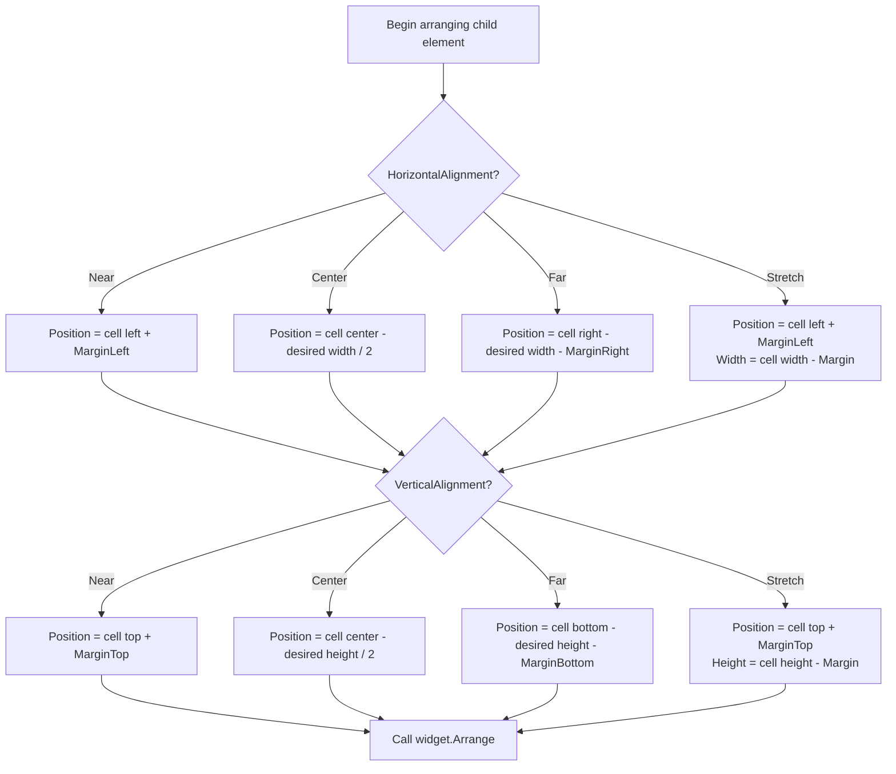
```mermaid
flowchart TD
    A[Begin arranging child element] --> B{HorizontalAlignment?}
    
    B -->|Near| C[Position = cell left + MarginLeft]
    B -->|Center| D[Position = cell center - desired width / 2]
    B -->|Far| E[Position = cell right - desired width - MarginRight]
    B -->|Stretch| F[Position = cell left + MarginLeft<br/>Width = cell width - Margin]
    
    C --> G{VerticalAlignment?}
    D --> G
    E --> G
    F --> G
    
    G -->|Near| H[Position = cell top + MarginTop]
    G -->|Center| I[Position = cell center - desired height / 2]
    G -->|Far| J[Position = cell bottom - desired height - MarginBottom]
    G -->|Stretch| K[Position = cell top + MarginTop<br/>Height = cell height - Margin]
    
    H --> L[Call widget.Arrange]
    I --> L
    J --> L
    K --> L
```

## 6. Container Components — Detailed Reference

### 6.1 CanvasWidget — Canvas Container (Absolute Positioning)

`CanvasWidget` supports setting absolute positions for child elements via the `SetPosition()` method.

**Core implementation:**

```csharp
public class CanvasWidget : ContainerWidget {
    public Dictionary<Widget, Vector2> m_positions = [];  // Child element position map
    public Vector2 Size { get; set; } = new(-1f);         // Container fixed size
    
    public static void SetPosition(Widget widget, Vector2 position) {
        (widget.ParentWidget as CanvasWidget)?.SetWidgetPosition(widget, position);
    }
}
```

**Measure logic:**

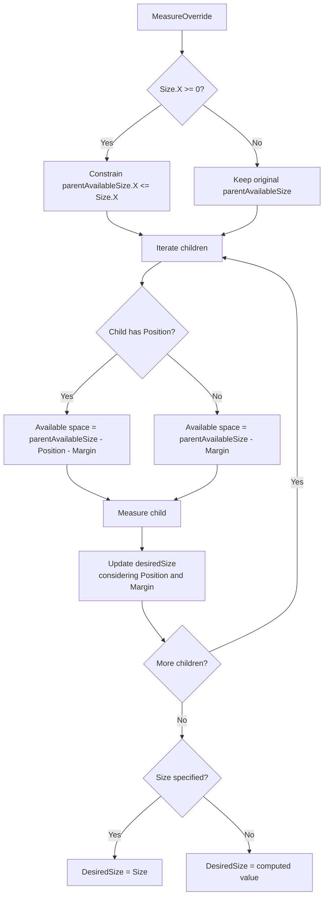
```mermaid
flowchart TD
    A[MeasureOverride] --> B{Size.X >= 0?}
    B -->|Yes| C[Constrain parentAvailableSize.X <= Size.X]
    B -->|No| D[Keep original parentAvailableSize]
    
    C --> E[Iterate children]
    D --> E
    
    E --> F{Child has Position?}
    F -->|Yes| G[Available space = parentAvailableSize - Position - Margin]
    F -->|No| H[Available space = parentAvailableSize - Margin]
    
    G --> I[Measure child]
    H --> I
    
    I --> J[Update desiredSize<br/>considering Position and Margin]
    J --> K{More children?}
    K -->|Yes| E
    K -->|No| L{Size specified?}
    
    L -->|Yes| M[DesiredSize = Size]
    L -->|No| N[DesiredSize = computed value]
```

**Arrange logic:**

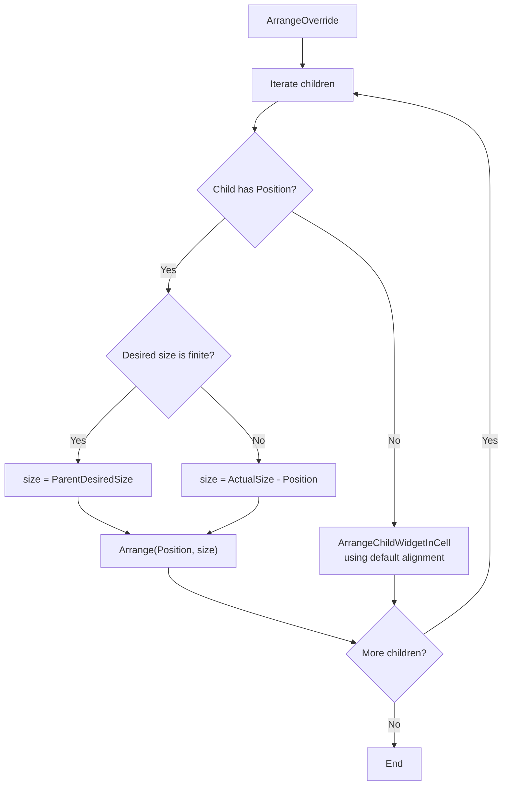
```mermaid
flowchart TD
    A[ArrangeOverride] --> B[Iterate children]
    B --> C{Child has Position?}
    
    C -->|Yes| D{Desired size is finite?}
    D -->|Yes| E[size = ParentDesiredSize]
    D -->|No| F[size = ActualSize - Position]
    
    E --> G["Arrange(Position, size)"]
    F --> G
    
    C -->|No| H[ArrangeChildWidgetInCell<br/>using default alignment]
    
    G --> I{More children?}
    H --> I
    I -->|Yes| B
    I -->|No| J[End]
```

### 6.2 StackPanelWidget — Stack Panel

`StackPanelWidget` arranges child elements sequentially in a horizontal or vertical direction, supporting both fixed sizes and fill mode.

**Core implementation:**

```csharp
public class StackPanelWidget : ContainerWidget {
    public float m_fixedSize;   // Total size of fixed-size children
    public int m_fillCount;     // Number of children in fill mode
    
    public LayoutDirection Direction { get; set; }
    public bool IsInverted { get; set; }  // Whether to arrange in reverse order
}
```

**Measure logic (horizontal direction example):**

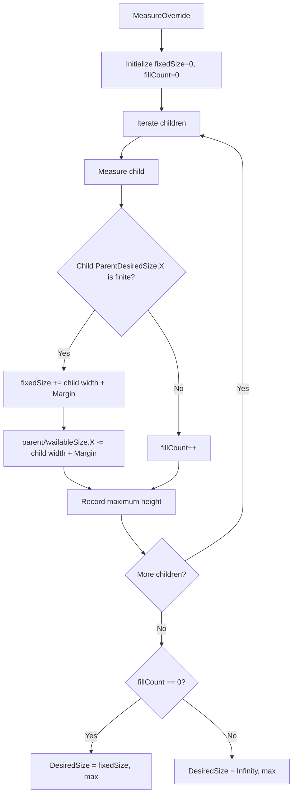
```mermaid
flowchart TD
    A[MeasureOverride] --> B[Initialize fixedSize=0, fillCount=0]
    B --> C[Iterate children]
    
    C --> D[Measure child]
    D --> E{Child ParentDesiredSize.X is finite?}
    
    E -->|Yes| F[fixedSize += child width + Margin]
    F --> G[parentAvailableSize.X -= child width + Margin]
    
    E -->|No| H[fillCount++]
    
    G --> I[Record maximum height]
    H --> I
    
    I --> J{More children?}
    J -->|Yes| C
    J -->|No| K{fillCount == 0?}
    
    K -->|Yes| L[DesiredSize = fixedSize, max]
    K -->|No| M[DesiredSize = Infinity, max]
```

**Arrange logic (horizontal direction example):**

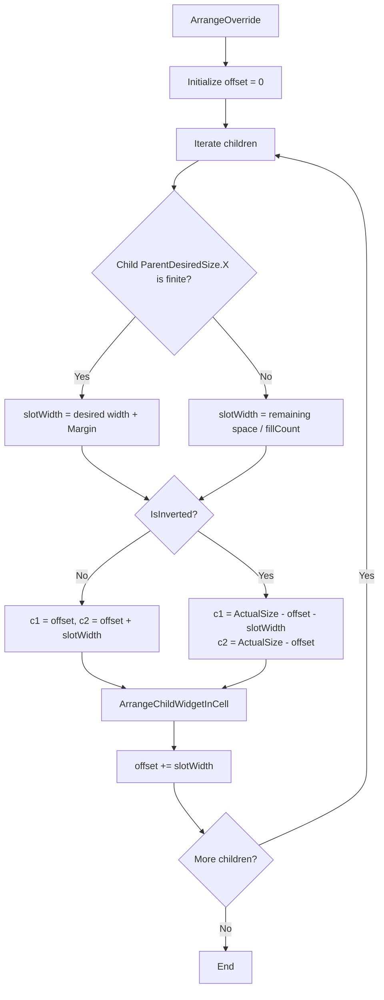
```mermaid
flowchart TD
    A[ArrangeOverride] --> B[Initialize offset = 0]
    B --> C[Iterate children]
    
    C --> D{Child ParentDesiredSize.X is finite?}
    
    D -->|Yes| E[slotWidth = desired width + Margin]
    D -->|No| F[slotWidth = remaining space / fillCount]
    
    E --> G{IsInverted?}
    F --> G
    
    G -->|No| H[c1 = offset, c2 = offset + slotWidth]
    G -->|Yes| I[c1 = ActualSize - offset - slotWidth<br/>c2 = ActualSize - offset]
    
    H --> J[ArrangeChildWidgetInCell]
    I --> J
    
    J --> K[offset += slotWidth]
    K --> L{More children?}
    L -->|Yes| C
    L -->|No| M[End]
```

**Fill mode example:**

```
Assume container width = 300px, with three children:
- Child A: desired width 100px (fixed)
- Child B: desired width Infinity (fill)
- Child C: desired width Infinity (fill)

Calculation:
- fixedSize = 100
- fillCount = 2
- Each fill element width = (300 - 100) / 2 = 100px

Final layout:
┌─────────┬─────────┬─────────┐
│    A    │    B    │    C    │
│  100px  │  100px  │  100px  │
└─────────┴─────────┴─────────┘
```

### 6.3 GridPanelWidget — Grid Panel

`GridPanelWidget` arranges child elements in a row-column grid, with each child able to specify which cell it occupies.

**Core implementation:**

```csharp
public class GridPanelWidget : ContainerWidget {
    public class Column {
        public float Position;      // Column start position
        public float ActualWidth;   // Column actual width
    }
    
    public class Row {
        public float Position;      // Row start position
        public float ActualHeight;  // Row actual height
    }
    
    public List<Column> m_columns = [];
    public List<Row> m_rows = [];
    public Dictionary<Widget, Point2> m_cells = [];  // Child element to cell mapping
    
    public static void SetCell(Widget widget, Point2 cell) {
        (widget.ParentWidget as GridPanelWidget)?.SetWidgetCell(widget, cell);
    }
}
```

**Measure logic:**

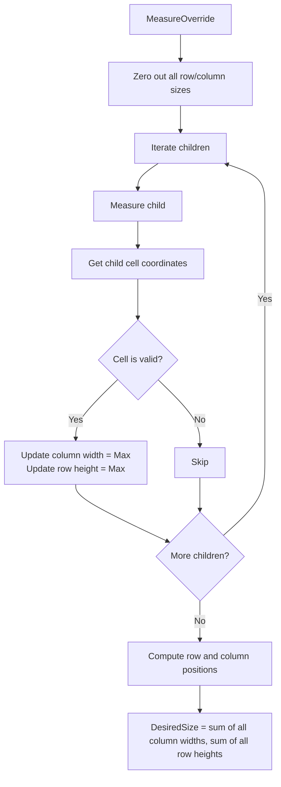
```mermaid
flowchart TD
    A[MeasureOverride] --> B[Zero out all row/column sizes]
    B --> C[Iterate children]
    
    C --> D[Measure child]
    D --> E[Get child cell coordinates]
    E --> F{Cell is valid?}
    
    F -->|Yes| G[Update column width = Max<br/>Update row height = Max]
    F -->|No| H[Skip]
    
    G --> I{More children?}
    H --> I
    I -->|Yes| C
    I -->|No| J[Compute row and column positions]
    
    J --> K[DesiredSize = sum of all column widths, sum of all row heights]
```

**Arrange logic:**

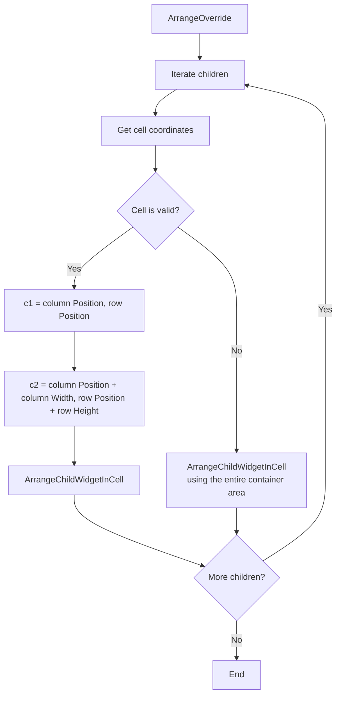
```mermaid
flowchart TD
    A[ArrangeOverride] --> B[Iterate children]
    B --> C[Get cell coordinates]
    C --> D{Cell is valid?}
    
    D -->|Yes| E[c1 = column Position, row Position]
    E --> F[c2 = column Position + column Width, row Position + row Height]
    F --> G[ArrangeChildWidgetInCell]
    
    D -->|No| H[ArrangeChildWidgetInCell<br/>using the entire container area]
    
    G --> I{More children?}
    H --> I
    I -->|Yes| B
    I -->|No| J[End]
```

**Grid layout example:**

```
GridPanelWidget (2 columns x 2 rows):
┌─────────────┬─────────────┐
│   (0, 0)    │   (1, 0)    │
│   Child A   │   Child B   │
├─────────────┼─────────────┤
│   (0, 1)    │   (1, 1)    │
│   Child C   │   Child D   │
└─────────────┴─────────────┘

Column width is automatically computed as the width of the widest child in that column
Row height is automatically computed as the height of the tallest child in that row
```

### 6.4 ScrollPanelWidget — Scroll Panel

`ScrollPanelWidget` provides horizontal or vertical scrolling, with support for inertial scrolling and a scroll bar.

**Core implementation:**

```csharp
public class ScrollPanelWidget : ContainerWidget {
    public LayoutDirection Direction { get; set; }
    public float ScrollPosition { get; set; }   // Current scroll position
    public float ScrollSpeed { get; set; }      // Scroll speed (inertia)
    
    public float m_scrollAreaLength;            // Total scroll area length
    public float m_scrollBarAlpha;              // Scroll bar opacity
}
```

**Measure logic:**

```csharp
public override void MeasureOverride(Vector2 parentAvailableSize) {
    foreach (Widget child in Children) {
        if (Direction == LayoutDirection.Horizontal) {
            // Horizontal scrolling: infinite width, constrained height
            child.Measure(new Vector2(float.MaxValue, parentAvailableSize.Y - child.MarginVerticalSum));
        } else {
            // Vertical scrolling: infinite height, constrained width
            child.Measure(new Vector2(parentAvailableSize.X - child.MarginHorizontalSum, float.MaxValue));
        }
    }
}
```

**Arrange logic:**

```csharp
public override void ArrangeOverride() {
    foreach (Widget child in Children) {
        Vector2 position = Vector2.Zero;
        Vector2 size = ActualSize;
        
        if (Direction == LayoutDirection.Horizontal) {
            position.X -= ScrollPosition;  // Horizontal offset
            size.X = position.X + child.ParentDesiredSize.X;
        } else {
            position.Y -= ScrollPosition;  // Vertical offset
            size.Y = position.Y + child.ParentDesiredSize.Y;
        }
        
        ArrangeChildWidgetInCell(position, size, child);
    }
}
```

**Scroll interaction logic:**

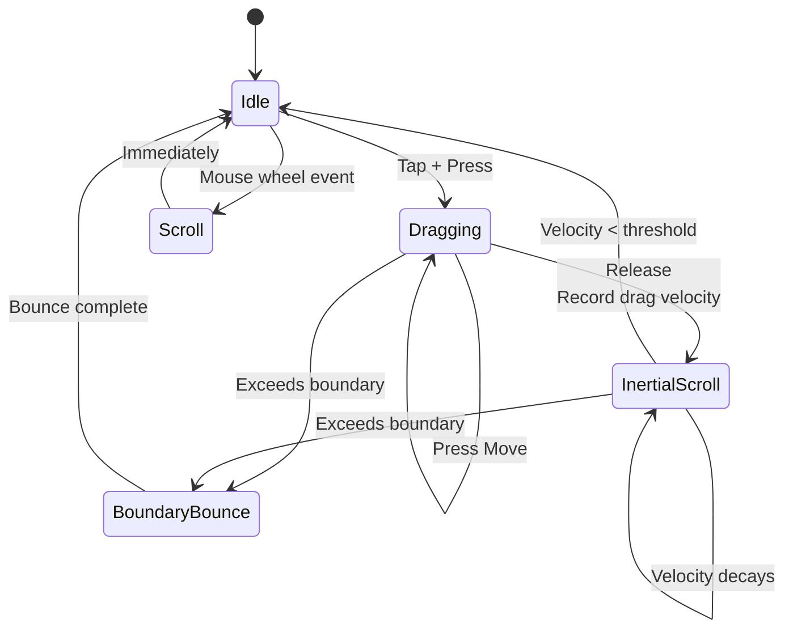
```mermaid
stateDiagram-v2
    [*] --> Idle
    
    Idle --> Dragging: Tap + Press
    Dragging --> Dragging: Press Move
    Dragging --> InertialScroll: Release<br/>Record drag velocity
    
    InertialScroll --> InertialScroll: Velocity decays
    InertialScroll --> Idle: Velocity < threshold
    
    Idle --> Scroll: Mouse wheel event
    Scroll --> Idle: Immediately
    
    Dragging --> BoundaryBounce: Exceeds boundary
    InertialScroll --> BoundaryBounce: Exceeds boundary
    BoundaryBounce --> Idle: Bounce complete
```

### 6.5 ListPanelWidget — Virtualized List Panel

`ListPanelWidget` extends `ScrollPanelWidget` and implements virtualized rendering — only creating and arranging list item widgets for the visible area.

**Core implementation:**

```csharp
public class ListPanelWidget : ScrollPanelWidget {
    public List<object> m_items = [];                    // Data item list
    public Dictionary<int, Widget> m_widgetsByIndex = []; // Index-to-Widget mapping
    
    public int m_firstVisibleIndex;   // Index of the first visible item
    public int m_lastVisibleIndex;    // Index of the last visible item
    
    public float ItemSize { get; set; }  // Fixed size per item
    public Func<object, Widget> ItemWidgetFactory { get; set; }  // Widget factory
}
```

**Virtualized rendering flow:**

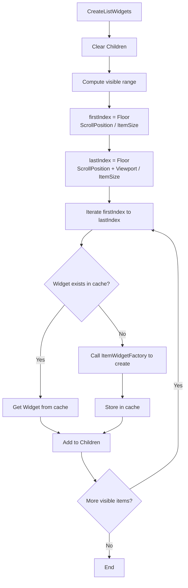
```mermaid
flowchart TD
    A[CreateListWidgets] --> B[Clear Children]
    B --> C[Compute visible range]
    
    C --> D[firstIndex = Floor<br/>ScrollPosition / ItemSize]
    D --> E[lastIndex = Floor<br/>ScrollPosition + Viewport / ItemSize]
    
    E --> F[Iterate firstIndex to lastIndex]
    F --> G{Widget exists in cache?}
    
    G -->|Yes| H[Get Widget from cache]
    G -->|No| I[Call ItemWidgetFactory to create]
    I --> J[Store in cache]
    
    H --> K[Add to Children]
    J --> K
    
    K --> L{More visible items?}
    L -->|Yes| F
    L -->|No| M[End]
```

**Advantages of virtualization:**

```
Assume a list with 1000 items, each 48px tall, viewport height 400px:

Traditional approach:
- Creates 1000 Widgets
- High memory usage
- Slow layout computation

Virtualized approach:
- Creates only ceil(400/48) + 1 ≈ 10 Widgets
- Reuses Widgets while scrolling
- Low memory usage
- Fast layout computation
```

### 6.6 UniformSpacingPanelWidget — Uniform Spacing Panel

`UniformSpacingPanelWidget` distributes child elements evenly within the available space.

**Core implementation:**

```csharp
public class UniformSpacingPanelWidget : ContainerWidget {
    public LayoutDirection Direction { get; set; }
    public int m_count;  // Number of visible child elements
}
```

**Measure logic:**

```csharp
public override void MeasureOverride(Vector2 parentAvailableSize) {
    m_count = Children.Count(c => c.IsVisible);
    
    // Allocate equal space to each child
    Vector2 childAvailableSize = Direction == LayoutDirection.Horizontal
        ? new Vector2(parentAvailableSize.X / m_count, parentAvailableSize.Y)
        : new Vector2(parentAvailableSize.X, parentAvailableSize.Y / m_count);
    
    foreach (Widget child in Children) {
        child.Measure(childAvailableSize - child.MarginHorizontalSumAndVerticalSum);
    }
    
    // Desired size is infinite (depends on parent container to allocate space)
    DesiredSize = Direction == LayoutDirection.Horizontal
        ? new Vector2(float.PositiveInfinity, maxChildHeight)
        : new Vector2(maxChildWidth, float.PositiveInfinity);
}
```

**Arrange logic:**

```csharp
public override void ArrangeOverride() {
    Vector2 offset = Vector2.Zero;
    foreach (Widget child in Children) {
        if (Direction == LayoutDirection.Horizontal) {
            float slotWidth = ActualSize.X / m_count;
            ArrangeChildWidgetInCell(offset, new Vector2(offset.X + slotWidth, ActualSize.Y), child);
            offset.X += slotWidth;
        } else {
            float slotHeight = ActualSize.Y / m_count;
            ArrangeChildWidgetInCell(offset, new Vector2(ActualSize.X, offset.Y + slotHeight), child);
            offset.Y += slotHeight;
        }
    }
}
```

## 7. Layout Flow — Illustrated

### 7.1 Complete Layout Flow

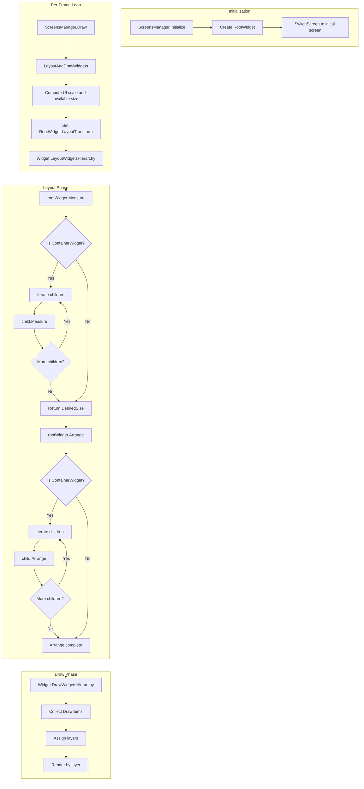
```mermaid
flowchart TD
    subgraph Initialization
        A[ScreensManager.Initialize] --> B[Create RootWidget]
        B --> C[SwitchScreen to initial screen]
    end
    
    subgraph Per-Frame Loop
        D[ScreensManager.Draw] --> E[LayoutAndDrawWidgets]
        E --> F[Compute UI scale and available size]
        F --> G[Set RootWidget.LayoutTransform]
        G --> H[Widget.LayoutWidgetsHierarchy]
    end
    
    subgraph Layout Phase
        H --> I[rootWidget.Measure]
        I --> J{Is ContainerWidget?}
        J -->|Yes| K[Iterate children]
        K --> L[child.Measure]
        L --> M{More children?}
        M -->|Yes| K
        M -->|No| N[Return DesiredSize]
        J -->|No| N
        
        N --> O[rootWidget.Arrange]
        O --> P{Is ContainerWidget?}
        P -->|Yes| Q[Iterate children]
        Q --> R[child.Arrange]
        R --> S{More children?}
        S -->|Yes| Q
        S -->|No| T[Arrange complete]
        P -->|No| T
    end
    
    subgraph Draw Phase
        T --> U[Widget.DrawWidgetsHierarchy]
        U --> V[Collect DrawItems]
        V --> W[Assign layers]
        W --> X[Render by layer]
    end
```

### 7.2 Measure Phase Recursive Call Chain

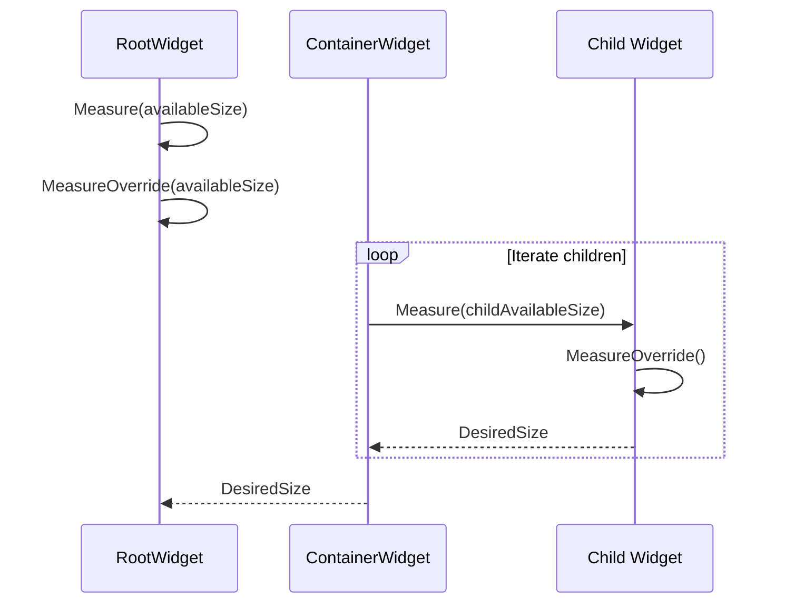
```mermaid
sequenceDiagram
    participant Root as RootWidget
    participant Container as ContainerWidget
    participant Child as Child Widget
    
    Root->>Root: Measure(availableSize)
    Root->>Root: MeasureOverride(availableSize)
    
    loop Iterate children
        Container->>Child: Measure(childAvailableSize)
        Child->>Child: MeasureOverride()
        Child-->>Container: DesiredSize
    end
    
    Container-->>Root: DesiredSize
```

### 7.3 Arrange Phase Recursive Call Chain

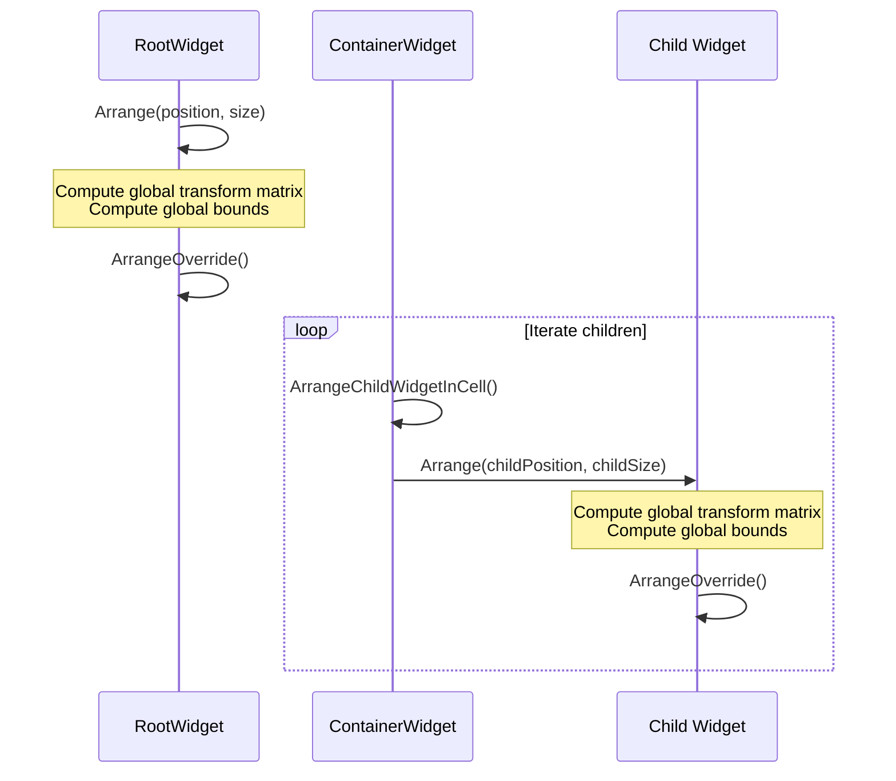
```mermaid
sequenceDiagram
    participant Root as RootWidget
    participant Container as ContainerWidget
    participant Child as Child Widget
    
    Root->>Root: Arrange(position, size)
    Note over Root: Compute global transform matrix<br/>Compute global bounds
    
    Root->>Root: ArrangeOverride()
    
    loop Iterate children
        Container->>Container: ArrangeChildWidgetInCell()
        Container->>Child: Arrange(childPosition, childSize)
        Note over Child: Compute global transform matrix<br/>Compute global bounds
        Child->>Child: ArrangeOverride()
    end
```

## 8. Update and Draw System

### 8.1 UI Main Loop Flow

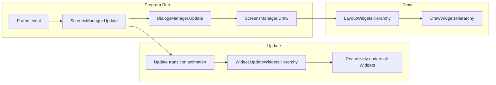
```mermaid
flowchart LR
    subgraph Program.Run
        A[Frame event] --> B[ScreensManager.Update]
        B --> C[DialogsManager.Update]
        C --> D[ScreensManager.Draw]
    end
    
    subgraph Update
        B --> E[Update transition animation]
        E --> F[Widget.UpdateWidgetsHierarchy]
        F --> G[Recursively update all Widgets]
    end
    
    subgraph Draw
        D --> H[LayoutWidgetsHierarchy]
        H --> I[DrawWidgetsHierarchy]
    end
```

### 8.2 UpdateWidgetsHierarchy

```csharp
public static void UpdateWidgetsHierarchy(Widget rootWidget) {
    if (rootWidget.IsUpdateEnabled) {
        bool isMouseCursorVisible = false;
        UpdateWidgetsHierarchy(rootWidget, ref isMouseCursorVisible);
        Mouse.IsMouseVisible = isMouseCursorVisible;
    }
}

public static void UpdateWidgetsHierarchy(Widget widget, ref bool isMouseCursorVisible) {
    if (!widget.IsVisible || !widget.IsUpdateEnabled || !widget.IsEnabled) {
        return;
    }
    
    // Update WidgetInput
    if (widget.WidgetsHierarchyInput != null) {
        widget.WidgetsHierarchyInput.Update();
        isMouseCursorVisible |= widget.WidgetsHierarchyInput.IsMouseCursorVisible;
    }
    
    // Recursively update children
    if (widget is ContainerWidget containerWidget) {
        for (int i = containerWidget.Children.Count - 1; i >= 0; i--) {
            UpdateWidgetsHierarchy(containerWidget.Children[i], ref isMouseCursorVisible);
        }
    }
    
    // Call Widget's Update
    widget.Update();
}
```

### 8.3 DrawContext and DrawItem

`DrawContext` manages the entire draw process, using a `DrawItem` queue to implement deferred rendering and layer sorting:

```csharp
public class DrawItem : IComparable<DrawItem> {
    public int Layer;              // Layer; lower values are drawn first
    public bool IsOverdraw;        // Whether this is an Overdraw task
    public Widget Widget;          // Associated Widget
    public Rectangle? ScissorRectangle;  // Clipping region
}
```

**Draw flow:**

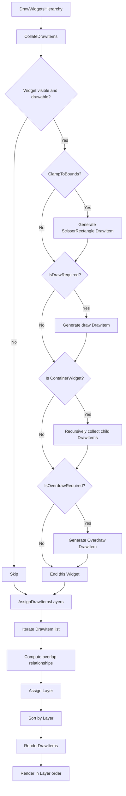
```mermaid
flowchart TD
    A[DrawWidgetsHierarchy] --> B[CollateDrawItems]
    
    B --> C{Widget visible and drawable?}
    C -->|No| D[Skip]
    C -->|Yes| E{ClampToBounds?}
    
    E -->|Yes| F[Generate ScissorRectangle DrawItem]
    E -->|No| G{IsDrawRequired?}
    
    F --> G
    G -->|Yes| H[Generate draw DrawItem]
    G -->|No| I{Is ContainerWidget?}
    
    H --> I
    I -->|Yes| J[Recursively collect child DrawItems]
    I -->|No| K{IsOverdrawRequired?}
    
    J --> K
    K -->|Yes| L[Generate Overdraw DrawItem]
    K -->|No| M[End this Widget]
    L --> M
    
    D --> N[AssignDrawItemsLayers]
    M --> N
    
    N --> O[Iterate DrawItem list]
    O --> P[Compute overlap relationships]
    P --> Q[Assign Layer]
    Q --> R[Sort by Layer]
    
    R --> S[RenderDrawItems]
    S --> T[Render in Layer order]
```

### 8.4 Layer Sorting Mechanism

Layer sorting ensures the correct draw order, so later-drawn items appear on top of earlier ones:

```csharp
public virtual void AssignDrawItemsLayers() {
    for (int i = 0; i < m_drawItems.Count; i++) {
        DrawItem drawItem = m_drawItems[i];
        for (int j = i + 1; j < m_drawItems.Count; j++) {
            DrawItem drawItem2 = m_drawItems[j];
            // ScissorRectangle increases the layer
            if (drawItem.ScissorRectangle.HasValue || drawItem2.ScissorRectangle.HasValue) {
                drawItem2.Layer = Math.Max(drawItem2.Layer, drawItem.Layer + 1);
            }
            // Overlapping Widgets increase the layer
            else if (TestOverlap(drawItem.Widget, drawItem2.Widget)) {
                drawItem2.Layer = Math.Max(drawItem2.Layer, drawItem.Layer + 1);
            }
        }
    }
    m_drawItems.Sort();  // Sort ascending by Layer
}
```

## 9. Usage Examples

### 9.1 XML Layout Definition

The UI can be defined via XML files, stored in the `Content/Assets/Widgets/` or `Content/Assets/Screens/` directories:

```xml
<CanvasWidget xmlns="runtime-namespace:Game" Size="400, 300">
    <LabelWidget Text="Title" HorizontalAlignment="Center" VerticalAlignment="Near" MarginTop="10" />
    <StackPanelWidget Direction="Vertical" Margin="10, 20">
        <ButtonWidget Text="Button1" MarginBottom="10" />
        <ButtonWidget Text="Button2" />
    </StackPanelWidget>
</CanvasWidget>
```

### 9.2 Creating Layouts in Code

```csharp
CanvasWidget canvas = new CanvasWidget {
    Size = new Vector2(400f, 300f)
};
canvas.AddChildren(new LabelWidget {
    Text = "Title",
    HorizontalAlignment = WidgetAlignment.Center,
    VerticalAlignment = WidgetAlignment.Near,
    MarginTop = 10f
});
StackPanelWidget stackPanel = new StackPanelWidget {
    Direction = LayoutDirection.Vertical,
    Margin = new Vector2(10f, 20f)
};
canvas.AddChildren(stackPanel);
stackPanel.AddChildren(new ButtonWidget {
    Text = "Button1",
    MarginBottom = 10f
});
stackPanel.AddChildren(new ButtonWidget {
    Text = "Button2"
});
```

### 9.3 Common Layout Patterns

**Centered dialog:**

```xml
<CanvasWidget Size="Infinity">
    <CanvasWidget Size="400, 300" HorizontalAlignment="Center" VerticalAlignment="Center">
        <!-- Dialog content -->
    </CanvasWidget>
</CanvasWidget>
```

**Bottom button bar:**

```xml
<CanvasWidget>
    <!-- Main content area -->
    <StackPanelWidget Direction="Horizontal" VerticalAlignment="Far">
        <ButtonWidget Text="OK" HorizontalAlignment="Stretch" />
        <ButtonWidget Text="Cancel" HorizontalAlignment="Stretch" />
    </StackPanelWidget>
</CanvasWidget>
```

**Scrollable list:**

```xml
<ScrollPanelWidget Direction="Vertical" ClampToBounds="true">
    <StackPanelWidget Direction="Vertical">
        <!-- List items -->
    </StackPanelWidget>
</ScrollPanelWidget>
```
